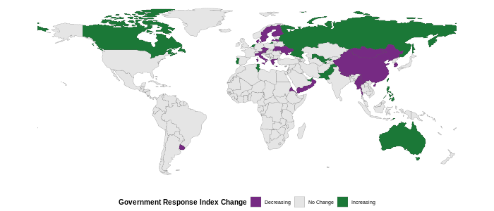

---  
layout: recent-changes  
title: Recent policy changes reported in the OxCGRT  
permalink: /recent-changes/  
---

This website contains recent policy changes reported in the global
Oxford COVID-19 Government Response Tracker (OxCGRT) database. It
includes policies which have come into force within the last two weeks.
It is arranged by country and then by indicator. For more details on the
coding policy please see our
[Codebook](https://github.com/OxCGRT/covid-policy-tracker/blob/master/documentation/codebook.md)
and [Interpretation
Guide](https://github.com/OxCGRT/covid-policy-tracker/blob/master/documentation/interpretation_guide.md).

Data in the OxCGRT database is recorded by volunteers from all over the
world on a weekly schedule. Our coverage may not yet be completely
up-to-date until the present day with recent policy changes. This site
is updated daily, so check back for the latest information.

## Global Changes in Government Response Index

The following map details the changes to the government response index
during the last two weeks. For more detail on the Government Response
Index please see the most recent [working
paper](https://www.bsg.ox.ac.uk/research/publications/variation-government-responses-covid-19)
or explore the [dataset
publication](https://doi.org/10.1038/s41562-021-01079-8).

<h4>

Overall increase

</h4>

<a href="#australia-gri-52--63">Australia (GRI: 52 ↑ 63)</a>

<a href="#canada-gri-71--72">Canada (GRI: 71 ↑ 72)</a>

<a href="#israel-gri-47--50">Israel (GRI: 47 ↑ 50)</a>

<a href="#kyrgyz republic-gri-53--54">Kyrgyz Republic (GRI: 53 ↑ 54)</a>

<a href="#libya-gri-43--49">Libya (GRI: 43 ↑ 49)</a>

<a href="#pakistan-gri-62--66">Pakistan (GRI: 62 ↑ 66)</a>

<a href="#philippines-gri-64--66">Philippines (GRI: 64 ↑ 66)</a>

<a href="#portugal-gri-68--74">Portugal (GRI: 68 ↑ 74)</a>

<a href="#russia-gri-54--58">Russia (GRI: 54 ↑ 58)</a>

<a href="#taiwan-gri-70--71">Taiwan (GRI: 70 ↑ 71)</a>

<a href="#timor-leste-gri-58--60">Timor-Leste (GRI: 58 ↑ 60)</a>

<a href="#tunisia-gri-69--72">Tunisia (GRI: 69 ↑ 72)</a>

<a href="#united arab emirates-gri-58--66">United Arab Emirates (GRI: 58
↑ 66)</a>

<a href="#united kingdom-gri-63--64">United Kingdom (GRI: 63 ↑ 64)</a>

<a href="#uzbekistan-gri-53--58">Uzbekistan (GRI: 53 ↑ 58)</a>

 

<h4>

Overall decrease

</h4>

<a href="#aruba-gri-39--34">Aruba (GRI: 39 ↓ 34)</a>

<a href="#austria-gri-73--67">Austria (GRI: 73 ↓ 67)</a>

<a href="#barbados-gri-65--57">Barbados (GRI: 65 ↓ 57)</a>

<a href="#china-gri-73--66">China (GRI: 73 ↓ 66)</a>

<a href="#czech republic-gri-55--52">Czech Republic (GRI: 55 ↓ 52)</a>

<a href="#denmark-gri-56--53">Denmark (GRI: 56 ↓ 53)</a>

<a href="#eritrea-gri-53--51">Eritrea (GRI: 53 ↓ 51)</a>

<a href="#finland-gri-55--54">Finland (GRI: 55 ↓ 54)</a>

<a href="#greece-gri-61--59">Greece (GRI: 61 ↓ 59)</a>

<a href="#iceland-gri-58--46">Iceland (GRI: 58 ↓ 46)</a>

<a href="#italy-gri-79--64">Italy (GRI: 79 ↓ 64)</a>

<a href="#latvia-gri-51--40">Latvia (GRI: 51 ↓ 40)</a>

<a href="#malta-gri-65--59">Malta (GRI: 65 ↓ 59)</a>

<a href="#monaco-gri-59--55">Monaco (GRI: 59 ↓ 55)</a>

<a href="#mongolia-gri-60--54">Mongolia (GRI: 60 ↓ 54)</a>

<a href="#mozambique-gri-51--48">Mozambique (GRI: 51 ↓ 48)</a>

<a href="#myanmar-gri-68--60">Myanmar (GRI: 68 ↓ 60)</a>

<a href="#namibia-gri-68--66">Namibia (GRI: 68 ↓ 66)</a>

<a href="#nepal-gri-72--66">Nepal (GRI: 72 ↓ 66)</a>

<a href="#netherlands-gri-67--49">Netherlands (GRI: 67 ↓ 49)</a>

<a href="#oman-gri-78--74">Oman (GRI: 78 ↓ 74)</a>

<a href="#poland-gri-62--60">Poland (GRI: 62 ↓ 60)</a>

<a href="#singapore-gri-77--74">Singapore (GRI: 77 ↓ 74)</a>

<a href="#south korea-gri-59--52">South Korea (GRI: 59 ↓ 52)</a>

<a href="#spain-gri-59--56">Spain (GRI: 59 ↓ 56)</a>

<a href="#sweden-gri-53--50">Sweden (GRI: 53 ↓ 50)</a>

<a href="#ukraine-gri-60--55">Ukraine (GRI: 60 ↓ 55)</a>

<a href="#uruguay-gri-61--60">Uruguay (GRI: 61 ↓ 60)</a>

<a href="#yemen-gri-38--37">Yemen (GRI: 38 ↓ 37)</a>

 

## Changes in Policy over the last two weeks

Please see our
[Codebook](https://github.com/OxCGRT/covid-policy-tracker/blob/master/documentation/codebook.md)
for a full description of the policies we track.

### Aruba (GRI: 39 ↓ 34)

#### Workplace closing (C2)

<table class="table" style="margin-left: auto; margin-right: auto;">

<tbody>

<tr>

<td style="text-align:left;min-width: 2in; ">

<b>Old policy:</b>

<b>Require</b> closure of <b>some</b> sectors of business; across
<b>all</b> of Aruba (2G)

</td>

<td style="text-align:left;min-width: 1in; color: grey80 !important;">

5/7/2021  

</td>

<td style="text-align:left;min-width: 2in; ">

<b>New policy:</b>

<b>No measures</b> are present across all of Aruba (0)

</td>

<td style="text-align:left;min-width: 4in; ">

As of Monday 5th July 2021 several COVID-19 related measures will be
removed: - Business closing time: will be based on normal legally
permitted closing time per type of business – Seating limitations:
e.g. at restaurants will be back to normal occupancy allowances –
Social distancing: 1.5m will no longer be required – Dancing: will be
permitted – Casinos & Bingos: will be back to normal operations –
Alcohol Ban: will no longer be in effect – Nightclubs / Bars: will be
allowed to re-open / be back to normal operations
<https://web.archive.org/web/20210705145249/https://www.visitaruba.com/news/general/corona-virus-and-travel-to-aruba/>

</td>

</tr>

</tbody>

</table>

### Australia (GRI: 52 ↑ 63)

#### Workplace closing (C2)

<table class="table" style="margin-left: auto; margin-right: auto;">

<tbody>

<tr>

<td style="text-align:left;min-width: 2in; ">

<b>Old policy:</b>

<b>Recommended closure </b> (or work from home) of businesses or open
with significant operational differences; in <b>some</b> parts of
Australia (1T)

</td>

<td style="text-align:left;min-width: 1in; color: grey80 !important;">

26/6/2021  

</td>

<td style="text-align:left;min-width: 2in; ">

<b>New policy:</b>

<b>Require</b> closure of <b>some</b> sectors of business; in
<b>some</b> parts of Australia (2T)

</td>

<td style="text-align:left;min-width: 4in; ">

New South Wales In response to a growing cluster of community
transmission within Sydney the Premier of NSW announced that some
workplaces would be ordered to close from Saturday 26th June 2021.
Workplace closures are in effect for Greater Sydney, including the Blue
Mountains, Central Coast, Wollongong and Shellharbour (all in New South
Wales). The following places in Greater Sydney are directed to be closed
to the public. • Pubs and registered clubs except for o selling food or
beverages for people to consume off-site and o providing accommodation,
including allowing food and drinks to be consumed in a person’s room. •
Food and drink premises, except for o selling food or beverages for
people to consume off-site o selling food to be consumed in a person’s
room if in a hotel or motel o if the premises are part of a shopping
centre, selling food or beverages for people to consume outside of the
shopping centre o holding a wedding or funeral in accordance with
relevant restrictions. • Entertainment facilities, such as theatres,
cinemas, music halls, concert halls and dance halls. • Amusement
centres, such as places to play billiards, pool, pinball machines or
video games. • Micro-breweries or small distilleries holding a drink
on-premises authorisation under the Liquor Act 2007 or cellar door
premises, except for selling food or beverages for people to consume off
the premises. • Indoor recreation facilities such as squash courts,
indoor swimming pools, gyms, table tennis centres, health studios,
bowling alleys and ice rinks. • Places of public worship, except for the
purposes of conducting a wedding or funeral service. • Hairdressers,
spas, nail salons, beauty salons, waxing salons, tanning salons, tattoo
parlours, massage parlours. • Auction houses • Betting agencies and
gaming lounges • Markets, except for food markets • Caravan parks and
camping grounds, except for o permanent residents or other people who
have no other place of permanent residence, and their visitors o people
who were staying there on Friday 25 June 2021 and have not extended
their booking. • Sex on premises services • Sex services premises •
Strip clubs • Public swimming pools (except natural swimming pools,
which may open) • National Trust properties and Historic Houses Trust of
NSW properties (other than retail shops) • Nightclubs • Casinos, except
for selling food or beverages for people to consume off-site and
providing accommodation, including allowing food and drinks to be
consumed in a person’s room..” Given that in person retail has not been
ordered to close, decision made to code as a level 2.
<http://web.archive.org/web/20210628124921/https://www.nsw.gov.au/covid-19/rules/greater-sydney>
<https://web.archive.org/web/20210628115612/https://legislation.nsw.gov.au/file/Public%20Health%20%28COVID-19%20Temporary%20Movement%20and%20Gathering%20Restrictions%29%20Order%202021.pdf>
<https://web.archive.org/web/20210628115746/https://www.health.nsw.gov.au/Infectious/covid-19/Pages/public-health-orders.aspx>

</td>

</tr>

<tr>

<td style="text-align:left;min-width: 2in; ">

<b>Old policy:</b>

<b>Require</b> closure of <b>some</b> sectors of business; in
<b>some</b> parts of Australia (2T)

</td>

<td style="text-align:left;min-width: 1in; color: grey80 !important;">

27/6/2021  

</td>

<td style="text-align:left;min-width: 2in; ">

<b>New policy:</b>

<b>Require</b> closure of <b>all</b> sectors of business; in <b>some</b>
parts of Australia (3T)

</td>

<td style="text-align:left;min-width: 4in; ">

The Northern Territory According to a press release on the Northern
Territory Government Covid-19 website, on the 27th June the Northern
Territory “Security and Emergency Management Committee made the decision
under the Northern Territory pandemic plan to lock down part of the NT
community. Effective from 1.00pm today – the Darwin, Palmerston and
Darwin rural areas will enter a full lockdown for 48 hours. That means
the local government areas of the City of Darwin, the City of
Palmerston, and Litchfield. This follows confirmation of four new
covid-19 positive cases all linked to the Tanami case.” “All businesses,
retail outlets, hospitality venues, gyms, pools and community centres
will be closed. Cafes and restaurants will be able to offer take-away
and delivery services.” Furthermore, it the NT COVID-19 government
website clearly states that only essential workers are able to leave
home in order to work. See archived URL for list of essential workers.
Northern territory workplace closures are more restrictive compared to
the New South Wales work place closures that came into effect on the
26th June 2021. Therefore changed to a 3T code.
<https://web.archive.org/web/20210628121424/https://coronavirus.nt.gov.au/stay-safe/advice-care/covid-19-lockdown-restrictions-in-place>
web.archive.org/web/20210627060745/<https://coronavirus.nt.gov.au/updates/items/2021-06-27-covid-19-update-lockdown-restrictions-in-place>
<http://web.archive.org/web/20210628132726/https://coronavirus.nt.gov.au/business-and-work/essential-workers>

</td>

</tr>

<tr>

<td style="text-align:left;min-width: 2in; ">

<b>Old policy:</b>

<b>Require</b> closure of <b>all</b> sectors of business; in <b>some</b>
parts of Australia (3T)

</td>

<td style="text-align:left;min-width: 1in; color: grey80 !important;">

29/6/2021  

</td>

<td style="text-align:left;min-width: 2in; ">

<b>New policy:</b>

<b>Require</b> closure of <b>some</b> sectors of business; in
<b>some</b> parts of Australia (2T)

</td>

<td style="text-align:left;min-width: 4in; ">

New South Wales: Travel for work or education is a reasonable excuse to
leave home if it is not possible to do it at home "“Employers must allow
an employee to work from home if it is reasonably practicable to do so.
If you cannot work from home and you go to your workplace, you must wear
a face mask (unless an exemption applies).”"
<https://web.archive.org/web/20210702185858/https://www.nsw.gov.au/covid-19/rules/border-restrictions>

</td>

</tr>

</tbody>

</table>

#### Cancel public events (C3)

<table class="table" style="margin-left: auto; margin-right: auto;">

<tbody>

<tr>

<td style="text-align:left;min-width: 2in; ">

<b>Old policy:</b>

<b>Recommend</b> cancellation of public events; in <b>some</b> parts of
Australia (1T)

</td>

<td style="text-align:left;min-width: 1in; color: grey80 !important;">

26/6/2021  

</td>

<td style="text-align:left;min-width: 2in; ">

<b>New policy:</b>

<b>Require</b> cancellation of public events; in <b>some</b> parts of
Australia (2T)

</td>

<td style="text-align:left;min-width: 4in; ">

New South Wales In response to a growing cluster of community
transmission within Sydney the Premier of NSW announced that more
stringent policy settings would be in place for residents of NSW from
from Saturday 26th June 2021. More specially for residents of Greater
Sydney, including the Blue Mountains, Central Coast, Wollongong and
Shellharbour (all in New South Wales): With some limited exemptions any
gatherings of more than 10 people regardless of whether the gathering is
private or part of an organised event is not allowed. Therefore coded as
a level 2 – cancelling of public events required.
<http://web.archive.org/web/20210628124921/https://www.nsw.gov.au/covid-19/rules/greater-sydney>
<https://web.archive.org/web/20210628115612/https://legislation.nsw.gov.au/file/Public%20Health%20%28COVID-19%20Temporary%20Movement%20and%20Gathering%20Restrictions%29%20Order%202021.pdf>
<https://web.archive.org/web/20210628115746/https://www.health.nsw.gov.au/Infectious/covid-19/Pages/public-health-orders.aspx>

</td>

</tr>

</tbody>

</table>

#### Stay at home requirements (C6)

<table class="table" style="margin-left: auto; margin-right: auto;">

<tbody>

<tr>

<td style="text-align:left;min-width: 2in; ">

<b>Old policy:</b>

<b>No measures</b> are present across all of Australia (0)

</td>

<td style="text-align:left;min-width: 1in; color: grey80 !important;">

26/6/2021  

</td>

<td style="text-align:left;min-width: 2in; ">

<b>New policy:</b>

<b>Require</b> not leaving the house with exceptions for daily exercise,
grocery shopping, and ‘essential’ trips; in <b>some</b> parts of
Australia (2T)

</td>

<td style="text-align:left;min-width: 4in; ">

New South Wales In response to a growing cluster of community
transmission within Sydney the Premier of NSW announced stay at home
orders which came into effect on Saturday 26th June 2021. Residents of
Greater Sydney, including the Blue Mountains, Central Coast, Wollongong
and Shellharbour (all in New South Wales) were ordered to stay at home,
unless they had one of the “reasonable excuses” to leave home. According
to the NSW government COVID-19 website the following are considered
reasonable excuses to leave home: “A reasonable excuse is if you need to
• obtain food or other goods and services o for the personal needs of
the household or for other household purposes (including pets) o for
vulnerable people o if the food or goods and services are not available
in the local government area that you live in • travel for work or
education if it is not possible to do it at home • exercise and take
outdoor recreation in Greater Sydney • go out for medical or caring
reasons, including obtaining a COVID-19 vaccination • donate blood •
access childcare • continue existing arrangements for access to, and
contact between, parents and children • attend a wedding or funeral •
provide care or assistance (including personal care) to a vulnerable
person or to provide emergency assistance • access social services,
employment services, services provided to victims (including as victims
of crime), domestic violence services, and mental health services • move
to a new place of residence, or between your different places of
residence • undertake legal obligations • avoid injury or illness or to
escape the risk of harm • in case of emergencies • for compassionate
reasons, including where two people are in a relationship but do not
necessarily live together • to provide pastoral care if you are a
priest, minister of religion or member of a religious order. Taking a
holiday is not a reasonable excuse.” This stay at home order is enforced
by the Public Health (COVID-19 Temporary Movement and Gathering
Restrictions) Order 2021 which came into effect from 26th June 2021.
Under the new Order, stay at home requirements have been extended to all
LGAs in the Greater Sydney area which includes the Blue Mountains,
Central Coast, Wollongong and Shellharbour. There are also additional
restrictions across NSW. The Order has commenced and will be in place
until midnight 9 July, unless extended or repealed earlier.
<https://web.archive.org/web/20210628115210/https://www.nsw.gov.au/covid-19/rules/greater-sydney>
<https://web.archive.org/web/20210628115612/https://legislation.nsw.gov.au/file/Public%20Health%20%28COVID-19%20Temporary%20Movement%20and%20Gathering%20Restrictions%29%20Order%202021.pdf>
<https://web.archive.org/web/20210628115746/https://www.health.nsw.gov.au/Infectious/covid-19/Pages/public-health-orders.aspx>

</td>

</tr>

</tbody>

</table>

### Austria (GRI: 73 ↓ 67)

#### Cancel public events (C3)

<table class="table" style="margin-left: auto; margin-right: auto;">

<tbody>

<tr>

<td style="text-align:left;min-width: 2in; ">

<b>Old policy:</b>

<b>Require</b> cancellation of public events; across <b>all</b> of
Austria (2G)

</td>

<td style="text-align:left;min-width: 1in; color: grey80 !important;">

1/7/2021  

</td>

<td style="text-align:left;min-width: 2in; ">

<b>New policy:</b>

<b>Recommend</b> cancellation of public events; across <b>all</b> of
Austria (1G)

</td>

<td style="text-align:left;min-width: 4in; ">

In principle, there are no longer any maximum limits and capacity
restrictions (NB see requirements for 100 or more below - which require
a 3-G certificate). As such coding as a 1G. Requirements • There is no
longer a mask requirement at events. • Meetings of 100 people or more
are notifiable. The participants have to show a 3-G certificate, which
has to be checked by the person responsible who must also develop and
implement a prevention concept and appoint a COVID-19 officer. •
Meetings of 500 people or more must be approved. The 3-G rule also
applies here. A prevention concept and the appointment of a COVID-19
officer is required. • At meetings with more than 100 people, a mask
must be worn in closed rooms, unless all people present a 3-G
certificate. Sources: <https://archive.vn/VVClW> \[Nationwide measures\]
<https://web.archive.org/web/20210701162048/https://www.sozialministerium.at/Informationen-zum-Coronavirus/Coronavirus---Aktuelle-Ma%C3%9Fnahmen.html>
\[Coronavirus - Current Measures\]

</td>

</tr>

</tbody>

</table>

#### Restrictions on gatherings (C4)

<table class="table" style="margin-left: auto; margin-right: auto;">

<tbody>

<tr>

<td style="text-align:left;min-width: 2in; ">

<b>Old policy:</b>

Restrictions on <b>small</b> gatherings (10 people or fewer); across
<b>all</b> of Austria (4G)

</td>

<td style="text-align:left;min-width: 1in; color: grey80 !important;">

1/7/2021  

</td>

<td style="text-align:left;min-width: 2in; ">

<b>New policy:</b>

Restrictions on <b>large</b> gatherings (between 101-1000 people);
across <b>all</b> of Austria (2G)

</td>

<td style="text-align:left;min-width: 4in; ">

In principle, there are no longer any maximum limits and capacity
restrictions (NB see requirements for 100 or more below - which require
a 3-G certificate). As such coding as a 2G (restrictions on gatherings
from 101 people). Requirements • There is no longer a mask requirement
at events. • Meetings of 100 people or more are notifiable. The
participants have to show a 3-G certificate, which has to be checked by
the person responsible who must also develop and implement a prevention
concept and appoint a COVID-19 officer. • Meetings of 500 people or more
must be approved. The 3-G rule also applies here. A prevention concept
and the appointment of a COVID-19 officer is required. • At meetings
with more than 100 people, a mask must be worn in closed rooms, unless
all people present a 3-G certificate. Sources:
<https://archive.vn/VVClW> \[Nationwide measures\]
<https://web.archive.org/web/20210701162048/https://www.sozialministerium.at/Informationen-zum-Coronavirus/Coronavirus---Aktuelle-Ma%C3%9Fnahmen.html>
\[Coronavirus - Current Measures\]

</td>

</tr>

</tbody>

</table>

### Barbados (GRI: 65 ↓ 57)

#### Stay at home requirements (C6)

<table class="table" style="margin-left: auto; margin-right: auto;">

<tbody>

<tr>

<td style="text-align:left;min-width: 2in; ">

<b>Old policy:</b>

<b>Require</b> not leaving the house with exceptions for daily exercise,
grocery shopping, and ‘essential’ trips; across <b>all</b> of Barbados
(2G)

</td>

<td style="text-align:left;min-width: 1in; color: grey80 !important;">

29/6/2021  

</td>

<td style="text-align:left;min-width: 2in; ">

<b>New policy:</b>

<b>No measures</b> are present across all of Barbados (0)

</td>

<td style="text-align:left;min-width: 4in; ">

Authorities in Barbados have eased certain COVID-19-related measures and
lifted all curfew restrictions effective June 29.
<https://web.archive.org/web/20210705203655/https://www.garda.com/crisis24/news-alerts/496516/barbados-authorities-lift-curfew-and-ease-some-covid-related-restrictions-june-29-update-31>

</td>

</tr>

</tbody>

</table>

#### Protection of elderly people (H8)

<table class="table" style="margin-left: auto; margin-right: auto;">

<tbody>

<tr>

<td style="text-align:left;min-width: 2in; ">

<b>Old policy:</b>

<b>Narrow restrictions</b> for protecting elderly people; across
<b>all</b> of Barbados (2G)

</td>

<td style="text-align:left;min-width: 1in; color: grey80 !important;">

29/6/2021  

</td>

<td style="text-align:left;min-width: 2in; ">

<b>New policy:</b>

<b>No measures</b> are present across all of Barbados (0)

</td>

<td style="text-align:left;min-width: 4in; ">

In line with C6. No other policies noted.
<https://web.archive.org/web/20210705203655/https://www.garda.com/crisis24/news-alerts/496516/barbados-authorities-lift-curfew-and-ease-some-covid-related-restrictions-june-29-update-31>

</td>

</tr>

</tbody>

</table>

### Canada (GRI: 71 ↑ 72)

#### Workplace closing (C2)

<table class="table" style="margin-left: auto; margin-right: auto;">

<tbody>

<tr>

<td style="text-align:left;min-width: 2in; ">

<b>Old policy:</b>

<b>Require</b> closure of <b>all</b> sectors of business; in <b>some</b>
parts of Canada (3T)

</td>

<td style="text-align:left;min-width: 1in; color: grey80 !important;">

25/6/2021  

</td>

<td style="text-align:left;min-width: 2in; ">

<b>New policy:</b>

<b>Require</b> closure of <b>some</b> sectors of business; in
<b>some</b> parts of Canada (2T)

</td>

<td style="text-align:left;min-width: 4in; ">

On 25 june 2021, in the Porcupine Health region (including city of
Timmins north to James Bay) of the province of Ontario, “nonessential
retail stores with outside doors are allowed to reopen with limited
capacity.” Shopping malls, hair salons, fitness studios and other
close-contact businesses remain closed throughout Ontario and some other
jurisdictions. See Porcupine Health Region and Retail Council of Canada
websites, archived:
<https://web.archive.org/web/20210626100713/https://www.porcupinehu.on.ca/en/your-health/infectious-diseases/novel-coronavirus/>
<https://web.archive.org/web/20210626102507/https://www.retailcouncil.org/coronavirus-info-for-retailers/provincial-reopening-frameworks/>

</td>

</tr>

</tbody>

</table>

#### Contact tracing (H3)

<table class="table" style="margin-left: auto; margin-right: auto;">

<tbody>

<tr>

<td style="text-align:left;min-width: 2in; ">

<b>Old policy:</b>

<b>Limited</b> contact tracing (not done for all identified cases); NA
Canada (1)

</td>

<td style="text-align:left;min-width: 1in; color: grey80 !important;">

28/6/2021  

</td>

<td style="text-align:left;min-width: 2in; ">

<b>New policy:</b>

<b>Comprehensive</b> contact tracing (done for all identified cases); NA
Canada (2)

</td>

<td style="text-align:left;min-width: 4in; ">

As of 28 june 2021, all provinces and territories are applying
government of Canada guidance that when individuals “test positive for
COVID-19, a public health official will ask you questions to collect
important information about your symptoms; activities and travel you did
before you tested positive; all the people you may have been in close
contact with while you were contagious …contact tracing. It’s a key
public health measure.” With daily case counts much lower than at peak
levels earlier in 2021 and recent isolated outbreaks subsiding, there is
no evidence in the past 10 days of contact tracing efforts failing to
keep up with new cases. See Government of Canada website, archived:
<https://web.archive.org/web/20210628112551/https://www.canada.ca/en/public-health/services/diseases/2019-novel-coronavirus-infection/symptoms/testing.html>

</td>

</tr>

</tbody>

</table>

### China (GRI: 73 ↓ 66)

#### School closing (C1)

<table class="table" style="margin-left: auto; margin-right: auto;">

<tbody>

<tr>

<td style="text-align:left;min-width: 2in; ">

<b>Old policy:</b>

<b>Require</b> closure of <b>all</b> levels of schools; in <b>some</b>
parts of China (3T)

</td>

<td style="text-align:left;min-width: 1in; color: grey80 !important;">

2/7/2021  

</td>

<td style="text-align:left;min-width: 2in; ">

<b>New policy:</b>

<b>Recommended closure</b> of schools or open with significant
operational differences; across <b>all</b> of China (1G)

</td>

<td style="text-align:left;min-width: 4in; ">

The last mid-risk area in Foshan was downgraded to low-risk on 2 July
2021. The last three mid-risk areas in the mainland China are in
Shenzhen and Dongguan. <https://archive.vn/kTq1C> No news suggests there
are school closing in the mainland China, but students and school staffs
living in those mid-risk areas have to stay home.
<https://archive.vn/aq3rA>

</td>

</tr>

</tbody>

</table>

#### Workplace closing (C2)

<table class="table" style="margin-left: auto; margin-right: auto;">

<tbody>

<tr>

<td style="text-align:left;min-width: 2in; ">

<b>Old policy:</b>

<b>Require</b> closure of <b>all</b> sectors of business; in <b>some</b>
parts of China (3T)

</td>

<td style="text-align:left;min-width: 1in; color: grey80 !important;">

24/6/2021  

</td>

<td style="text-align:left;min-width: 2in; ">

<b>New policy:</b>

<b>Require</b> closure of <b>some</b> sectors of business; in
<b>some</b> parts of China (2T)

</td>

<td style="text-align:left;min-width: 4in; ">

All high-risk areas were downgraded to mid-risk on 24 June; most
non-essential workplace are required to close in mid-risk areas.
<https://archive.vn/0Wj9j> <https://archive.vn/YwvAt>

</td>

</tr>

</tbody>

</table>

#### Facial Coverings (H6)

<table class="table" style="margin-left: auto; margin-right: auto;">

<tbody>

<tr>

<td style="text-align:left;min-width: 2in; ">

<b>Old policy:</b>

<b>Required</b> wearing of face masks at <b>all times</b> outside the
home; in <b>some</b> parts of China (4T)

</td>

<td style="text-align:left;min-width: 1in; color: grey80 !important;">

24/6/2021  

</td>

<td style="text-align:left;min-width: 2in; ">

<b>New policy:</b>

<b>Required</b> wearing of face masks in <b>specific shared spaces</b>
outside the home when other people are present; across <b>all</b> of
China (2G)

</td>

<td style="text-align:left;min-width: 4in; ">

The government announced that there is no longer high-risk regions in
China. Archive link: <https://archive.ph/UMbUV> Original link:
<https://baijiahao.baidu.com/s?id=1703416850570107379&wfr=spider&for=pc>

</td>

</tr>

</tbody>

</table>

### Czech Republic (GRI: 55 ↓ 52)

#### Workplace closing (C2)

<table class="table" style="margin-left: auto; margin-right: auto;">

<tbody>

<tr>

<td style="text-align:left;min-width: 2in; ">

<b>Old policy:</b>

<b>Require</b> closure of <b>some</b> sectors of business; across
<b>all</b> of Czech Republic (2G)

</td>

<td style="text-align:left;min-width: 1in; color: grey80 !important;">

29/6/2021  

</td>

<td style="text-align:left;min-width: 2in; ">

<b>New policy:</b>

<b>Recommended closure </b> (or work from home) of businesses or open
with significant operational differences; across <b>all</b> of Czech
Republic (1G)

</td>

<td style="text-align:left;min-width: 4in; ">

Working from home is not mandatory, although the government recommends
doing so when possible and regularly testing employees in the work
place. Nonessential businesses (including restaurants, bars, and cafes)
are allowed to open with restrictions on capacity, social distancing
measures and mask requirements in place. Link:
<https://web.archive.org/web/20210705125412/https://covid.gov.cz/en/situations/business-activities/home-office-business>
<https://web.archive.org/web/20210705130340/https://covid.gov.cz/en/situations/shops-and-services/restaurants-bars-and-cafes>
<https://web.archive.org/web/20210705130637/https://www.garda.com/crisis24/news-alerts/496761/czech-republic-authorities-maintaining-covid-19-measures-as-of-june-30-update-44>

</td>

</tr>

</tbody>

</table>

#### Vaccination policy (H7)

<table class="table" style="margin-left: auto; margin-right: auto;">

<tbody>

<tr>

<td style="text-align:left;min-width: 2in; ">

<b>Old policy:</b>

Available to ALL key group (key workers, elderly, clinically vulnerable)
plus additional availability to wider population; at no / minimal cost
to the individual (government funded or subsidised) Czech Republic (4S)

</td>

<td style="text-align:left;min-width: 1in; color: grey80 !important;">

29/6/2021  

</td>

<td style="text-align:left;min-width: 2in; ">

<b>New policy:</b>

<b>Universal</b> availability; at no / minimal cost to the individual
(government funded or subsidised) Czech Republic (5S)

</td>

<td style="text-align:left;min-width: 4in; ">

People over 16 can register for a vaccination. This includes people who
do not have public health insurance in the Czech Republic or the
European Union but who have resided in the Czech Republic for a long
time. Vaccination is voluntary and covered by public health insurance.
All persons who are registered for public health insurance in the Czech
Republic can be vaccinated free of charge. Vaccines: Pfizer, Moderna,
AstraZeneca, Janssen Link:
<https://web.archive.org/web/20210705141726/https://koronavirus.mzcr.cz/ockovani-proti-covid-19/>
<https://web.archive.org/web/20210705142250/https://covid19.trackvaccines.org/country/czechia/>
<https://web.archive.org/web/20210705142339/https://covid.gov.cz/en/situations/information-about-vaccine/information-about-available-vaccines>

</td>

</tr>

</tbody>

</table>

#### Protection of elderly people (H8)

<table class="table" style="margin-left: auto; margin-right: auto;">

<tbody>

<tr>

<td style="text-align:left;min-width: 2in; ">

<b>Old policy:</b>

<b>Extensive restrictions</b> for protection of elderly people; across
<b>all</b> of Czech Republic (3G)

</td>

<td style="text-align:left;min-width: 1in; color: grey80 !important;">

29/6/2021  

</td>

<td style="text-align:left;min-width: 2in; ">

<b>New policy:</b>

<b>Narrow restrictions</b> for protecting elderly people; across
<b>all</b> of Czech Republic (2G)

</td>

<td style="text-align:left;min-width: 4in; ">

Visits to nursing homes are possible if visitors complete one of the
following: 1) undergo a PCR test on site, 2) provide evidence of a
negative PCR or antigen test that is no more than 72 hours old, 3)
provide Covid-19 vaccination certificate (vaccine must have been
administered 22 days prior to visit), or 4) prove that you had and
recovered from Covid-19 no more than 180 days before the date of the
visit. Link:
<https://web.archive.org/web/20210705143247/https://covid.gov.cz/en/situations/hospitals-and-sanitary-facilities/visits-social-facilities>

</td>

</tr>

</tbody>

</table>

### Denmark (GRI: 56 ↓ 53)

#### Restrictions on gatherings (C4)

<table class="table" style="margin-left: auto; margin-right: auto;">

<tbody>

<tr>

<td style="text-align:left;min-width: 2in; ">

<b>Old policy:</b>

Restrictions on <b>medium</b> gatherings (11-100 people); across
<b>all</b> of Denmark (3G)

</td>

<td style="text-align:left;min-width: 1in; color: grey80 !important;">

2/7/2021  

</td>

<td style="text-align:left;min-width: 2in; ">

<b>New policy:</b>

Restrictions on <b>large</b> gatherings (between 101-1000 people);
across <b>all</b> of Denmark (2G)

</td>

<td style="text-align:left;min-width: 4in; ">

The maximum number of people allowed to gather has been increased to 250
people in public indoor places.
<http://web.archive.org/web/20210702192433/https://en.coronasmitte.dk/latest-updates?__cf_chl_captcha_tk__=34bdcb80d05a677ebfe223914a0be0bd0560ff58-1625253467-0-AWvjJ7Zq1dIf0JdlVePfrWsH2gourNi-9fkgtlIgiWdwxY9i374IP0vv3NuNFJQ34ldXOsOfHEmW-A_b0r0bFvzXUvYdhImr_W6xVXpzKI984MybUbvAZ6KfCwwB0Hg8fFzIukK9az3tV_amEQ3YUIxNrW3vnIJ9ugtYHnuioeS6htwmnF7tDotoAuz7gqGuRct2Uy_gkf2ONW88mXVXpfTamct-cDbS2KqHtQw8_sXwpsrl4ilJlTIm76y57ImpqSh9NJQKFsPEvKANq5suuhmv5KUpgbUzFuFyaQD6dMKh3QJt7v-08b4N7H9SvQ6pfqoWByIcY7YAad-J44McGSz5IsC6CylzCRM9azwYEwY2MRHJOJpCcrKZkm84vhrwK3pVc8djuyS6IFooA1JCfLjAt16BJMbz3uYT000Sl237r8frp7-pVNt4jbxvRFBuKEP3gfYK3KsKaEfn7FdlQ909sM1QY8fG1GqpfrWfxMKKgH_OUzXn6u4Bb9N1I6mgL2dtg06H8uIJk_XKngSeOJU6z6wA5Opf3TVc2zuE-5nrZqDGar6FWDTHXOkD8pEAr6WW79NHKx982Ti9X2QBDivEpu4ur-R1DTIgt6g-3QYUxW5AhbQSJzhmD9dVbbcOUkZbltLmxZLhRi-jgOUMyL_GTcG6KfnSmRoc9uEruksOfu3tDoehARY32upwTXQXwQ>

</td>

</tr>

</tbody>

</table>

#### Income support (E1)

<table class="table" style="margin-left: auto; margin-right: auto;">

<tbody>

<tr>

<td style="text-align:left;min-width: 2in; ">

<b>Old policy:</b>

Government is replacing <b>more than 50% income</b>; for <b>all
workers</b> in Denmark (2A)

</td>

<td style="text-align:left;min-width: 1in; color: grey80 !important;">

1/7/2021  

</td>

<td style="text-align:left;min-width: 2in; ">

<b>New policy:</b>

Government is replacing <b>more than 50% income</b>; for <b>formal
workers only</b> in Denmark (2F)

</td>

<td style="text-align:left;min-width: 4in; ">

General wage compensation for all workers ended June 2021, however,
Salary compensation is still available until 31 August 2021 for
companies with a ban on being open such as nightclubs, discos, venues
with standing audiences and exhibition centers etc.
<https://archive.vn/2021.07.02-194835/https://virk.dk/myndigheder/stat/ERST/selvbetjening/Midlertidig_loenkompensation_til_virksomheder_med_forbud_mod_at_holde_aabent_som_foelge_af_coronaviruscovid-19_for_perioden_fra_den_6_november>
<https://archive.vn/2021.07.02-195430/https://virksomhedsguiden.dk/content/temaer/coronavirus_og_din_virksomhed/ydelser/loenkompensation/8a8e7687-ab06-4524-aea6-dea26d6e95da/>

</td>

</tr>

</tbody>

</table>

### Eritrea (GRI: 53 ↓ 51)

#### Restrictions on gatherings (C4)

<table class="table" style="margin-left: auto; margin-right: auto;">

<tbody>

<tr>

<td style="text-align:left;min-width: 2in; ">

<b>Old policy:</b>

Restrictions on <b>small</b> gatherings (10 people or fewer); across
<b>all</b> of Eritrea (4G)

</td>

<td style="text-align:left;min-width: 1in; color: grey80 !important;">

28/6/2021  

</td>

<td style="text-align:left;min-width: 2in; ">

<b>New policy:</b>

Restrictions on <b>medium</b> gatherings (11-100 people); across
<b>all</b> of Eritrea (3G)

</td>

<td style="text-align:left;min-width: 4in; ">

large gatherings such as weddings and funerals can go up to 40 people
<https://web.archive.org/web/20210704121744/https://er.usembassy.gov/covid-19-information/>

</td>

</tr>

</tbody>

</table>

### Finland (GRI: 55 ↓ 54)

#### School closing (C1)

<table class="table" style="margin-left: auto; margin-right: auto;">

<tbody>

<tr>

<td style="text-align:left;min-width: 2in; ">

<b>Old policy:</b>

<b>Require</b> closure of <b>some</b> levels of schools; in <b>some</b>
parts of Finland (2T)

</td>

<td style="text-align:left;min-width: 1in; color: grey80 !important;">

1/7/2021  

</td>

<td style="text-align:left;min-width: 2in; ">

<b>New policy:</b>

<b>Recommended closure</b> of schools or open with significant
operational differences; across <b>all</b> of Finland (1G)

</td>

<td style="text-align:left;min-width: 4in; ">

The coronavirus situation in Kymenlaakso is in the baseline phase
throughout the region, Contact teaching can be arranged in all
educational stages. In higher education, it is recommended that teaching
is organized in such a way that close contacts can be effectively
avoided. These instructions apply to indoor teaching for groups of more
than 10 people.
<https://archive.vn/2021.07.02-205139/https://korona.kymsote.fi/en/kymenlaakso-recommendations/>
Unable to find any other region where there distant learning only at
some or all level of education, so code changed to 1G.

</td>

</tr>

</tbody>

</table>

#### Workplace closing (C2)

<table class="table" style="margin-left: auto; margin-right: auto;">

<tbody>

<tr>

<td style="text-align:left;min-width: 2in; ">

<b>Old policy:</b>

<b>Require</b> closure of <b>some</b> sectors of business; in
<b>some</b> parts of Finland (2T)

</td>

<td style="text-align:left;min-width: 1in; color: grey80 !important;">

1/7/2021  

</td>

<td style="text-align:left;min-width: 2in; ">

<b>New policy:</b>

<b>Recommended closure </b> (or work from home) of businesses or open
with significant operational differences; across <b>all</b> of Finland
(1G)

</td>

<td style="text-align:left;min-width: 4in; ">

Gyms are now open in Helsinki and Espoo.
<https://archive.vn/2021.07.02-212730/https://www.hel.fi/helsinki/coronavirus-en/information/recommendations-and-restrictions-effective>
<https://archive.vn/2021.07.02-212803/https://www.espoo.fi/en-US/City_of_Espoo/Whats_on/Corona_Virus/Restrictions_and_recommendations>
There is no evidence that any businesses are closed, so code is changed
to 1G. See all covid-19 restrictions on the hospital district websites -
<https://archive.vn/2021.07.02-214837/https://valtioneuvosto.fi/en/information-on-coronavirus/current-restrictions/hospital-districts>

</td>

</tr>

</tbody>

</table>

#### Vaccination policy (H7)

<table class="table" style="margin-left: auto; margin-right: auto;">

<tbody>

<tr>

<td style="text-align:left;min-width: 2in; ">

<b>Old policy:</b>

Available to ALL key group (key workers, elderly, clinically vulnerable)
plus additional availability to wider population; at no / minimal cost
to the individual (government funded or subsidised) Finland (4S)

</td>

<td style="text-align:left;min-width: 1in; color: grey80 !important;">

28/6/2021  

</td>

<td style="text-align:left;min-width: 2in; ">

<b>New policy:</b>

<b>Universal</b> availability; at no / minimal cost to the individual
(government funded or subsidised) Finland (5S)

</td>

<td style="text-align:left;min-width: 4in; ">

Vaccines are generally available to people of 16yrs and above.
<https://archive.vn/2021.06.29-085405/https://sampo.thl.fi/pivot/prod/fi/vaccreg/cov19cov/summary_cov19ageareacov>
Aland -
<https://archive.vn/2021.06.29-084221/https://www.ahs.ax/aktuellt-om-coronavaccineringen>
Helsinki -
<https://archive.vn/2021.06.29-065438/https://www.hel.fi/uutiset/en/social-services-and-health-care/coronavirus-vaccinations-begin-for-helsinki-residents-aged-16-24>
Soite -
<https://archive.vn/2021.06.29-065619/https://korona.soite.fi/en/corona-virus-info/>
Soster -
<https://archive.vn/2021.06.29-085248/https://www.sosteri.fi/koronavirus-sosterissa/koronarokotukset-vaestolle/>
Current vaccines administered include Pfizer-BioNTech vaccine
(Comirnaty), Moderna, AstraZeneca, and Johnson\&Johnson.
<https://archive.vn/2021.06.29-061601/https://fi.usembassy.gov/covid-19-information/>
Up-to-date vaccination coverage: first dose 57.7%, second dose 17.6%
Vaccinated subjects included in the coverage calculations: First dose
3204657, second dose 977142 Total doses of coronary vaccine
administered: First dose 3220572, second dose 980821
<http://web.archive.org/web/20210629083532/https://www.thl.fi/episeuranta/rokotukset/koronarokotusten_edistyminen.html>

</td>

</tr>

</tbody>

</table>

### Greece (GRI: 61 ↓ 59)

#### Stay at home requirements (C6)

<table class="table" style="margin-left: auto; margin-right: auto;">

<tbody>

<tr>

<td style="text-align:left;min-width: 2in; ">

<b>Old policy:</b>

<b>Require</b> not leaving the house with exceptions for daily exercise,
grocery shopping, and ‘essential’ trips; across <b>all</b> of Greece
(2G)

</td>

<td style="text-align:left;min-width: 1in; color: grey80 !important;">

28/6/2021  

</td>

<td style="text-align:left;min-width: 2in; ">

<b>New policy:</b>

<b>Recommend</b> not leaving the house; across <b>all</b> of Greece (1G)

</td>

<td style="text-align:left;min-width: 4in; ">

Curfew Lifted: The nighttime curfew is no longer in effect as of 5:00am
on Monday, June 28th.
<http://web.archive.org/web/20210705081152/https://gr.usembassy.gov/covid-19-information/>

</td>

</tr>

</tbody>

</table>

#### Testing policy (H2)

<table class="table" style="margin-left: auto; margin-right: auto;">

<tbody>

<tr>

<td style="text-align:left;min-width: 2in; ">

<b>Old policy:</b>

Anyone <b>symptomatic</b> can be tested; NA Greece (2)

</td>

<td style="text-align:left;min-width: 1in; color: grey80 !important;">

22/6/2021  

</td>

<td style="text-align:left;min-width: 2in; ">

<b>New policy:</b>

<b>Anyone</b> can be tested (open testing) is present; NA Greece (3)

</td>

<td style="text-align:left;min-width: 4in; ">

Free rapid tests for SARS-CoV-2 detection by EODY COMMs continue
throughout the country
<http://web.archive.org/web/20210705190620/https://eody.gov.gr/synechizontai-se-oli-tin-epikrateia-ta-dorean-rapid-test-gia-anichneysi-sars-cov-2-apo-tis-komy-toy-eody/>

</td>

</tr>

</tbody>

</table>

#### Facial Coverings (H6)

<table class="table" style="margin-left: auto; margin-right: auto;">

<tbody>

<tr>

<td style="text-align:left;min-width: 2in; ">

<b>Old policy:</b>

<b>Required</b> wearing of face masks at <b>all times</b> outside the
home; across <b>all</b> of Greece (4G)

</td>

<td style="text-align:left;min-width: 1in; color: grey80 !important;">

22/6/2021  

</td>

<td style="text-align:left;min-width: 2in; ">

<b>New policy:</b>

<b>Required</b> wearing of face masks in <b>all shared spaces</b>
outside the home when other people are present <b>or</b> when social
distancing not possible; across <b>all</b> of Greece (3G)

</td>

<td style="text-align:left;min-width: 4in; ">

Masks are no longer required in uncrowded outdoor areas. Masks are still
required in all indoor areas.
<http://web.archive.org/web/20210705081152/https://gr.usembassy.gov/covid-19-information/>

</td>

</tr>

</tbody>

</table>

### Iceland (GRI: 58 ↓ 46)

#### Workplace closing (C2)

<table class="table" style="margin-left: auto; margin-right: auto;">

<tbody>

<tr>

<td style="text-align:left;min-width: 2in; ">

<b>Old policy:</b>

<b>Recommended closure </b> (or work from home) of businesses or open
with significant operational differences; across <b>all</b> of Iceland
(1G)

</td>

<td style="text-align:left;min-width: 1in; color: grey80 !important;">

26/6/2021  

</td>

<td style="text-align:left;min-width: 2in; ">

<b>New policy:</b>

<b>No measures</b> are present across all of Iceland (0)

</td>

<td style="text-align:left;min-width: 4in; ">

As of June 26th 2021 restrictions on any kind of operations are no
longer applicable, neither the obligation to register guests nor
restrictions on opening hours
<https://web.archive.org/web/20210706095418/https://www.covid.is/categories/effective-restrictions-on-gatherings>

</td>

</tr>

</tbody>

</table>

#### Cancel public events (C3)

<table class="table" style="margin-left: auto; margin-right: auto;">

<tbody>

<tr>

<td style="text-align:left;min-width: 2in; ">

<b>Old policy:</b>

<b>Recommend</b> cancellation of public events; across <b>all</b> of
Iceland (1G)

</td>

<td style="text-align:left;min-width: 1in; color: grey80 !important;">

26/6/2021  

</td>

<td style="text-align:left;min-width: 2in; ">

<b>New policy:</b>

<b>No measures</b> are present across all of Iceland (0)

</td>

<td style="text-align:left;min-width: 4in; ">

As of June 26th 2021 no restrictions on gatherings due to COVID-19 apply
in Iceland Limits to the number of people at gatherings are none Social
distancing rules are none
<https://web.archive.org/web/20210706095418/https://www.covid.is/categories/effective-restrictions-on-gatherings>

</td>

</tr>

</tbody>

</table>

#### Restrictions on gatherings (C4)

<table class="table" style="margin-left: auto; margin-right: auto;">

<tbody>

<tr>

<td style="text-align:left;min-width: 2in; ">

<b>Old policy:</b>

Restrictions on <b>large</b> gatherings (between 101-1000 people);
across <b>all</b> of Iceland (2G)

</td>

<td style="text-align:left;min-width: 1in; color: grey80 !important;">

26/6/2021  

</td>

<td style="text-align:left;min-width: 2in; ">

<b>New policy:</b>

<b>No measures</b> are present across all of Iceland (0)

</td>

<td style="text-align:left;min-width: 4in; ">

As of June 26th 2021 no restrictions on gatherings due to COVID-19 apply
in Iceland Limits to the number of people at gatherings are none Social
distancing rules are none
<https://web.archive.org/web/20210706095418/https://www.covid.is/categories/effective-restrictions-on-gatherings>

</td>

</tr>

</tbody>

</table>

#### International travel controls (C8)

<table class="table" style="margin-left: auto; margin-right: auto;">

<tbody>

<tr>

<td style="text-align:left;min-width: 2in; ">

<b>Old policy:</b>

<b>Quarantine</b> arrivals from <b>some</b> regions coming into Iceland
(2)

</td>

<td style="text-align:left;min-width: 1in; color: grey80 !important;">

22/6/2021  

</td>

<td style="text-align:left;min-width: 2in; ">

<b>New policy:</b>

<b>Ban</b> arrivals from <b>some</b> regions coming into Iceland (3)

</td>

<td style="text-align:left;min-width: 4in; ">

There are no travel restrictions on the citizens and permanent residents
of EEA/EFTA countries (as well as Andorra, Monaco, San Marino or the
Vatican) but travellers who have not been vaccinated or previously
infected with covid-19 are subject to testing and quarantine
requirements. Travellers from outside the EEA/EFTA area who are not
relatives of an EEA/EFTA citizen and not from exempted countries may not
enter Iceland unless the provide a valid reason.
<https://web.archive.org/web/20210706095256/https://island.is/en/p/entry>

</td>

</tr>

</tbody>

</table>

#### Facial Coverings (H6)

<table class="table" style="margin-left: auto; margin-right: auto;">

<tbody>

<tr>

<td style="text-align:left;min-width: 2in; ">

<b>Old policy:</b>

<b>Required</b> wearing of face masks in <b>specific shared spaces</b>
outside the home when other people are present; across <b>all</b> of
Iceland (2G)

</td>

<td style="text-align:left;min-width: 1in; color: grey80 !important;">

26/6/2021  

</td>

<td style="text-align:left;min-width: 2in; ">

<b>New policy:</b>

<b>No face mask measures</b> are present across all of Iceland (0)

</td>

<td style="text-align:left;min-width: 4in; ">

As of June 26th 2021 masks are not mandatory anywhere
<https://web.archive.org/web/20210706095418/https://www.covid.is/categories/effective-restrictions-on-gatherings>

</td>

</tr>

</tbody>

</table>

### Israel (GRI: 47 ↑ 50)

#### School closing (C1)

<table class="table" style="margin-left: auto; margin-right: auto;">

<tbody>

<tr>

<td style="text-align:left;min-width: 2in; ">

<b>Old policy:</b>

<b>Recommended closure</b> of schools or open with significant
operational differences; in <b>some</b> parts of Israel (1T)

</td>

<td style="text-align:left;min-width: 1in; color: grey80 !important;">

25/6/2021  

</td>

<td style="text-align:left;min-width: 2in; ">

<b>New policy:</b>

<b>Recommended closure</b> of schools or open with significant
operational differences; across <b>all</b> of Israel (1G)

</td>

<td style="text-align:left;min-width: 4in; ">

As of noon, a mask now required indoors. In a select few areas, masks
are required indoors and outdoors in schools. Coding to 1G as now
different to pre-covid times and to recognise the change from no masks
to masks indoors again throughout the country. Source:
<https://web.archive.org/web/20210628185349/https://www.gov.il/en/departments/news/25062021-01>

</td>

</tr>

</tbody>

</table>

#### Workplace closing (C2)

<table class="table" style="margin-left: auto; margin-right: auto;">

<tbody>

<tr>

<td style="text-align:left;min-width: 2in; ">

<b>Old policy:</b>

<b>No measures</b> are present across all of Israel (0)

</td>

<td style="text-align:left;min-width: 1in; color: grey80 !important;">

25/6/2021  

</td>

<td style="text-align:left;min-width: 2in; ">

<b>New policy:</b>

<b>Recommended closure </b> (or work from home) of businesses or open
with significant operational differences; across <b>all</b> of Israel
(1G)

</td>

<td style="text-align:left;min-width: 4in; ">

A mask is now required indoors. Changing back to 1G to recognise this
change and new restrictions. Source:
<https://web.archive.org/web/20210628185349/https://www.gov.il/en/departments/news/25062021-01>

</td>

</tr>

</tbody>

</table>

#### Facial Coverings (H6)

<table class="table" style="margin-left: auto; margin-right: auto;">

<tbody>

<tr>

<td style="text-align:left;min-width: 2in; ">

<b>Old policy:</b>

<b>Required</b> wearing of face masks in <b>specific shared spaces</b>
outside the home when other people are present; in <b>some</b> parts of
Israel (2T)

</td>

<td style="text-align:left;min-width: 1in; color: grey80 !important;">

23/6/2021  

</td>

<td style="text-align:left;min-width: 2in; ">

<b>New policy:</b>

<b>Required</b> wearing of face masks in <b>specific shared spaces</b>
outside the home when other people are present; across <b>all</b> of
Israel (2G)

</td>

<td style="text-align:left;min-width: 4in; ">

Amendment to the People’s Health Ordinance (Novel Coronavirus) (Home
Isolation and Various Provisions) (Temporary Provision), 5781-2021
requires masks to be worn also in an international airport, in border
crossing points and anywhere where medical treatment is provided.
Source: <https://archive.vn/FpVJC> \[Ministry of Health\]

</td>

</tr>

</tbody>

</table>

### Italy (GRI: 79 ↓ 64)

#### Workplace closing (C2)

<table class="table" style="margin-left: auto; margin-right: auto;">

<tbody>

<tr>

<td style="text-align:left;min-width: 2in; ">

<b>Old policy:</b>

<b>Require</b> closure of <b>all</b> sectors of business; in <b>some</b>
parts of Italy (3T)

</td>

<td style="text-align:left;min-width: 1in; color: grey80 !important;">

1/7/2021  

</td>

<td style="text-align:left;min-width: 2in; ">

<b>New policy:</b>

<b>Require</b> closure of <b>some</b> sectors of business; across
<b>all</b> of Italy (2G)

</td>

<td style="text-align:left;min-width: 4in; ">

All regions are classified as White Zones where all businesses are now
open with the exception of discos which are still closed
<http://web.archive.org/web/20210701183556/https://www.agi.it/cronaca/news/2021-07-01/discoteche-ancora-chiuse-pressing-riapertura-13122139/>
<https://web.archive.org/web/20210630192012/https://www.governo.it/it/articolo/domande-frequenti-sulle-misure-adottate-dal-governo/15638>
the remaining red zones have been removed so Italy is now all in white
zones
<https://web.archive.org/web/20210630152057/https://gds.it/articoli/cronaca/2021/06/30/coronavirus-sicilia-da-oggi-tutta-bianca-musumeci-revoca-le-ultime-due-zone-rosse-46199b17-575c-4007-b21e-1c48144a9c1b/>

</td>

</tr>

</tbody>

</table>

#### Cancel public events (C3)

<table class="table" style="margin-left: auto; margin-right: auto;">

<tbody>

<tr>

<td style="text-align:left;min-width: 2in; ">

<b>Old policy:</b>

<b>Require</b> cancellation of public events; in <b>some</b> parts of
Italy (2T)

</td>

<td style="text-align:left;min-width: 1in; color: grey80 !important;">

1/7/2021  

</td>

<td style="text-align:left;min-width: 2in; ">

<b>New policy:</b>

<b>Recommend</b> cancellation of public events; across <b>all</b> of
Italy (1G)

</td>

<td style="text-align:left;min-width: 4in; ">

the remaining red zones have been removed so Italy is now all in white
zones.
<https://web.archive.org/web/20210630152057/https://gds.it/articoli/cronaca/2021/06/30/coronavirus-sicilia-da-oggi-tutta-bianca-musumeci-revoca-le-ultime-due-zone-rosse-46199b17-575c-4007-b21e-1c48144a9c1b/>
Events can be held with special hygiene and distancing measures.
<https://web.archive.org/web/20210615074201/https://www.puntosicuro.it/sicurezza-sul-lavoro-C-1/coronavirus-covid19-C-131/covid-19-nuove-aree-bianche-novita-per-congressi-grandi-eventi-AR-21345/>
<https://web.archive.org/web/20210630192012/https://www.governo.it/it/articolo/domande-frequenti-sulle-misure-adottate-dal-governo/15638>

</td>

</tr>

</tbody>

</table>

#### Restrictions on gatherings (C4)

<table class="table" style="margin-left: auto; margin-right: auto;">

<tbody>

<tr>

<td style="text-align:left;min-width: 2in; ">

<b>Old policy:</b>

Restrictions on <b>small</b> gatherings (10 people or fewer); in
<b>some</b> parts of Italy (4T)

</td>

<td style="text-align:left;min-width: 1in; color: grey80 !important;">

1/7/2021  

</td>

<td style="text-align:left;min-width: 2in; ">

<b>New policy:</b>

Restrictions on <b>large</b> gatherings (between 101-1000 people);
across <b>all</b> of Italy (2G)

</td>

<td style="text-align:left;min-width: 4in; ">

the max number on gatherings will depend on the total volume where the
event is hosted, nonetheless there is a max of 500 participants for
closed spaces and 100 for open air spaces
<https://web.archive.org/web/20201113065608/https://www.camera.it/temiap/documentazione/temi/pdf/1203754.pdf?_1588279335853>

</td>

</tr>

</tbody>

</table>

#### Stay at home requirements (C6)

<table class="table" style="margin-left: auto; margin-right: auto;">

<tbody>

<tr>

<td style="text-align:left;min-width: 2in; ">

<b>Old policy:</b>

<b>Require</b> not leaving the house with exceptions for daily exercise,
grocery shopping, and ‘essential’ trips; in <b>some</b> parts of Italy
(2T)

</td>

<td style="text-align:left;min-width: 1in; color: grey80 !important;">

1/7/2021  

</td>

<td style="text-align:left;min-width: 2in; ">

<b>New policy:</b>

<b>No measures</b> are present across all of Italy (0)

</td>

<td style="text-align:left;min-width: 4in; ">

Does not appear to be any stay at home requirements in white zones, and
all of Italy is now a white zone.
<https://web.archive.org/web/20210622042434/https://www.today.it/attualita/mascherine-fine-obbligo-28-giugno-2021.html>

</td>

</tr>

</tbody>

</table>

#### Restrictions on internal movement (C7)

<table class="table" style="margin-left: auto; margin-right: auto;">

<tbody>

<tr>

<td style="text-align:left;min-width: 2in; ">

<b>Old policy:</b>

<b>Internal travel restrictions</b> are in place; in <b>some</b> parts
of Italy (2T)

</td>

<td style="text-align:left;min-width: 1in; color: grey80 !important;">

1/7/2021  

</td>

<td style="text-align:left;min-width: 2in; ">

<b>New policy:</b>

<b>No measures</b> are present across all of Italy (0)

</td>

<td style="text-align:left;min-width: 4in; ">

No restrictions on internal movements in white zones and all of Italy is
now a white zone. If zone designations change, internal movement
restrictions may be triggered.
<https://web.archive.org/web/20210622042434/https://www.today.it/attualita/mascherine-fine-obbligo-28-giugno-2021.html>

</td>

</tr>

</tbody>

</table>

#### Facial Coverings (H6)

<table class="table" style="margin-left: auto; margin-right: auto;">

<tbody>

<tr>

<td style="text-align:left;min-width: 2in; ">

<b>Old policy:</b>

<b>Required</b> wearing of face masks at <b>all times</b> outside the
home; in <b>some</b> parts of Italy (4T)

</td>

<td style="text-align:left;min-width: 1in; color: grey80 !important;">

28/6/2021  

</td>

<td style="text-align:left;min-width: 2in; ">

<b>New policy:</b>

<b>Required</b> wearing of face masks in <b>specific shared spaces</b>
outside the home when other people are present; across <b>all</b> of
Italy (2G)

</td>

<td style="text-align:left;min-width: 4in; ">

masks can now be removed in the open air if social distancing can be
guaranteed
<https://web.archive.org/web/20210627100418/https://www.romatoday.it/attualita/mascherine-obbligatorie-quando.html>

</td>

</tr>

</tbody>

</table>

### Kyrgyz Republic (GRI: 53 ↑ 54)

#### Restrictions on internal movement (C7)

<table class="table" style="margin-left: auto; margin-right: auto;">

<tbody>

<tr>

<td style="text-align:left;min-width: 2in; ">

<b>Old policy:</b>

<b>No measures</b> are present across all of Kyrgyz Republic (0)

</td>

<td style="text-align:left;min-width: 1in; color: grey80 !important;">

26/6/2021  

</td>

<td style="text-align:left;min-width: 2in; ">

<b>New policy:</b>

<b>Recommend</b> to not travel between regions/cities; in <b>some</b>
parts of Kyrgyz Republic (1T)

</td>

<td style="text-align:left;min-width: 4in; ">

Authorities have advised to limit travel to Bishkek and Osh cities as
well as in Chui and Osh oblasts (1). Other than that, there are no
restrictions on intercity or interstate travel. (1)
<https://web.archive.org/web/20210704143747/https://www.gov.uk/foreign-travel-advice/kyrgyzstan/coronavirus>
(2)
<https://web.archive.org/web/20210704142934/https://kg.usembassy.gov/covid-19-information/>

</td>

</tr>

</tbody>

</table>

#### Facial Coverings (H6)

<table class="table" style="margin-left: auto; margin-right: auto;">

<tbody>

<tr>

<td style="text-align:left;min-width: 2in; ">

<b>Old policy:</b>

<b>Required</b> wearing of face masks in <b>all shared spaces</b>
outside the home when other people are present <b>or</b> when social
distancing not possible; across <b>all</b> of Kyrgyz Republic (3G)

</td>

<td style="text-align:left;min-width: 1in; color: grey80 !important;">

26/6/2021  

</td>

<td style="text-align:left;min-width: 2in; ">

<b>New policy:</b>

<b>Required</b> wearing of face masks in <b>specific shared spaces</b>
outside the home when other people are present; across <b>all</b> of
Kyrgyz Republic (2G)

</td>

<td style="text-align:left;min-width: 4in; ">

Facial coverings seem not to be required in all public spaces anymore.
"“Some businesses and other organisations need visitors to wear a face
mask.”" (1) Masks are required in public transport. (2) (1)
<https://web.archive.org/web/20210704143747/https://www.gov.uk/foreign-travel-advice/kyrgyzstan/coronavirus>
(2)
<https://web.archive.org/web/20210704142934/https://kg.usembassy.gov/covid-19-information/>

</td>

</tr>

</tbody>

</table>

#### Vaccination policy (H7)

<table class="table" style="margin-left: auto; margin-right: auto;">

<tbody>

<tr>

<td style="text-align:left;min-width: 2in; ">

<b>Old policy:</b>

Available to ALL key group (key workers, elderly, clinically vulnerable)
plus additional availability to wider population; at no / minimal cost
to the individual (government funded or subsidised) Kyrgyz Republic (4S)

</td>

<td style="text-align:left;min-width: 1in; color: grey80 !important;">

26/6/2021  

</td>

<td style="text-align:left;min-width: 2in; ">

<b>New policy:</b>

<b>Universal</b> availability; at no / minimal cost to the individual
(government funded or subsidised) Kyrgyz Republic (5S)

</td>

<td style="text-align:left;min-width: 4in; ">

No changes found. Vaccines: Sinopharm, SputnikV Sinopharm: available at
government clinics for everyone SputnikV: available for people over 65
and those with chronic conditions
<https://web.archive.org/web/20210704142934/https://kg.usembassy.gov/covid-19-information/>

</td>

</tr>

</tbody>

</table>

### Latvia (GRI: 51 ↓ 40)

#### Income support (E1)

<table class="table" style="margin-left: auto; margin-right: auto;">

<tbody>

<tr>

<td style="text-align:left;min-width: 2in; ">

<b>Old policy:</b>

Government is replacing <b>more than 50% income</b>; for <b>all
workers</b> in Latvia (2A)

</td>

<td style="text-align:left;min-width: 1in; color: grey80 !important;">

1/7/2021  

</td>

<td style="text-align:left;min-width: 2in; ">

<b>New policy:</b>

<b>No income support</b> is present across all of Latvia (0)

</td>

<td style="text-align:left;min-width: 4in; ">

Income support scheme expired as of July 1st, 2021.
<https://web.archive.org/web/20210705143825/https://covid19.gov.lv/index.php/atbalsts-sabiedribai/ekonomika/atbalsts-uznemejiem-un-darbiniekiem>

</td>

</tr>

</tbody>

</table>

#### Debt/contract relief (E2)

<table class="table" style="margin-left: auto; margin-right: auto;">

<tbody>

<tr>

<td style="text-align:left;min-width: 2in; ">

<b>Old policy:</b>

Government is providing <b>narrow debt relief</b> across all of; NA
Latvia (1)

</td>

<td style="text-align:left;min-width: 1in; color: grey80 !important;">

1/7/2021  

</td>

<td style="text-align:left;min-width: 2in; ">

<b>New policy:</b>

<b>No debt relief</b> is present across all of Latvia (0)

</td>

<td style="text-align:left;min-width: 4in; ">

Debt relief not available after June 30, 2021.
<https://web.archive.org/web/20210705143825/https://covid19.gov.lv/index.php/atbalsts-sabiedribai/ekonomika/atbalsts-uznemejiem-un-darbiniekiem>

</td>

</tr>

</tbody>

</table>

#### Facial Coverings (H6)

<table class="table" style="margin-left: auto; margin-right: auto;">

<tbody>

<tr>

<td style="text-align:left;min-width: 2in; ">

<b>Old policy:</b>

<b>Required</b> wearing of face masks in <b>all shared spaces</b>
outside the home when other people are present <b>or</b> when social
distancing not possible; across <b>all</b> of Latvia (3G)

</td>

<td style="text-align:left;min-width: 1in; color: grey80 !important;">

29/6/2021  

</td>

<td style="text-align:left;min-width: 2in; ">

<b>New policy:</b>

<b>Required</b> wearing of face masks in <b>specific shared spaces</b>
outside the home when other people are present; across <b>all</b> of
Latvia (2G)

</td>

<td style="text-align:left;min-width: 4in; ">

Required in all indoor public places, but not in outdoor public places.
<https://web.archive.org/web/20210705142940/https://covid19.gov.lv/en/support-society/how-behave-safely/covid-19-control-measures>

</td>

</tr>

</tbody>

</table>

### Libya (GRI: 43 ↑ 49)

#### School closing (C1)

<table class="table" style="margin-left: auto; margin-right: auto;">

<tbody>

<tr>

<td style="text-align:left;min-width: 2in; ">

<b>Old policy:</b>

<b>No measures</b> are present across all of Libya (0)

</td>

<td style="text-align:left;min-width: 1in; color: grey80 !important;">

25/6/2021  

</td>

<td style="text-align:left;min-width: 2in; ">

<b>New policy:</b>

<b>Require</b> closure of <b>some</b> levels of schools; across
<b>all</b> of Libya (2G)

</td>

<td style="text-align:left;min-width: 4in; ">

Schools partially closed for 41+ weeks, per UNESCO.
<https://web.archive.org/web/20210705183902/https://en.unesco.org/covid19/educationresponse#schoolclosures>

</td>

</tr>

</tbody>

</table>

#### Restrictions on gatherings (C4)

<table class="table" style="margin-left: auto; margin-right: auto;">

<tbody>

<tr>

<td style="text-align:left;min-width: 2in; ">

<b>Old policy:</b>

Restrictions on <b>medium</b> gatherings (11-100 people); across
<b>all</b> of Libya (3G)

</td>

<td style="text-align:left;min-width: 1in; color: grey80 !important;">

25/6/2021  

</td>

<td style="text-align:left;min-width: 2in; ">

<b>New policy:</b>

Restrictions on <b>small</b> gatherings (10 people or fewer); across
<b>all</b> of Libya (4G)

</td>

<td style="text-align:left;min-width: 4in; ">

"“Large gatherings (both public and private) are currently prohibited.”"
<https://web.archive.org/web/20210705184409/https://ly.usembassy.gov/u-s-citizen-services/covid-19-information/>

</td>

</tr>

</tbody>

</table>

#### Restrictions on internal movement (C7)

<table class="table" style="margin-left: auto; margin-right: auto;">

<tbody>

<tr>

<td style="text-align:left;min-width: 2in; ">

<b>Old policy:</b>

<b>Recommend</b> to not travel between regions/cities; across <b>all</b>
of Libya (1G)

</td>

<td style="text-align:left;min-width: 1in; color: grey80 !important;">

25/6/2021  

</td>

<td style="text-align:left;min-width: 2in; ">

<b>New policy:</b>

<b>Internal travel restrictions</b> are in place; across <b>all</b> of
Libya (2G)

</td>

<td style="text-align:left;min-width: 4in; ">

Travel prohibited within curfew hours.
<https://web.archive.org/web/20210705190659/https://cdn.anvilgroup.com/AAAAAAAA-1111-AAAA-1111-AAAAAAAAAAAA/Covid-19%20Global%20Travel%20Restrictions.pdf>

</td>

</tr>

</tbody>

</table>

#### Public information campaigns (H1)

<table class="table" style="margin-left: auto; margin-right: auto;">

<tbody>

<tr>

<td style="text-align:left;min-width: 2in; ">

<b>Old policy:</b>

Public officials <b>urge caution</b> about COVID-19 in; across
<b>all</b> of Libya (1G)

</td>

<td style="text-align:left;min-width: 1in; color: grey80 !important;">

25/6/2021  

</td>

<td style="text-align:left;min-width: 2in; ">

<b>New policy:</b>

Public officials have a <b>co-ordinated public information campaign</b>
about COVID-19; across <b>all</b> of Libya (2G)

</td>

<td style="text-align:left;min-width: 4in; ">

The Libyan NCDC website gives weekly reports and press releases on the
Covid-19 pandemic, which although lagged, provide significant data on
the situation.
<https://web.archive.org/web/20210705193142/https://ncdc.org.ly/Ar/>

</td>

</tr>

</tbody>

</table>

#### Vaccination policy (H7)

<table class="table" style="margin-left: auto; margin-right: auto;">

<tbody>

<tr>

<td style="text-align:left;min-width: 2in; ">

<b>Old policy:</b>

Available to <b>ALL</b> key group (key workers, elderly, clinically
vulnerable); at no / minimal cost to the individual (government funded
or subsidised) Libya (3S)

</td>

<td style="text-align:left;min-width: 1in; color: grey80 !important;">

25/6/2021  

</td>

<td style="text-align:left;min-width: 2in; ">

<b>New policy:</b>

Available to <b>ONE</b> key group (key workers, elderly, clinically
vulnerable); at no / minimal cost to the individual (government funded
or subsidised) Libya (1S)

</td>

<td style="text-align:left;min-width: 4in; ">

Sputnik V vaccine approved, and divided among groups A, B and C, based
on the limited availability.
<https://web.archive.org/web/20210705184409/https://ly.usembassy.gov/u-s-citizen-services/covid-19-information/>

</td>

</tr>

</tbody>

</table>

#### Protection of elderly people (H8)

<table class="table" style="margin-left: auto; margin-right: auto;">

<tbody>

<tr>

<td style="text-align:left;min-width: 2in; ">

<b>Old policy:</b>

<b>Narrow restrictions</b> for protecting elderly people; across
<b>all</b> of Libya (2G)

</td>

<td style="text-align:left;min-width: 1in; color: grey80 !important;">

25/6/2021  

</td>

<td style="text-align:left;min-width: 2in; ">

<b>New policy:</b>

<b>No measures</b> are present across all of Libya (0)

</td>

<td style="text-align:left;min-width: 4in; ">

No evidence of measures specific to elderly people beyond those applying
to the general public.
<https://web.archive.org/web/20210705184409/https://ly.usembassy.gov/u-s-citizen-services/covid-19-information/>

</td>

</tr>

</tbody>

</table>

### Malta (GRI: 65 ↓ 59)

#### School closing (C1)

<table class="table" style="margin-left: auto; margin-right: auto;">

<tbody>

<tr>

<td style="text-align:left;min-width: 2in; ">

<b>Old policy:</b>

<b>Require</b> closure of <b>some</b> levels of schools; across
<b>all</b> of Malta (2G)

</td>

<td style="text-align:left;min-width: 1in; color: grey80 !important;">

28/6/2021  

</td>

<td style="text-align:left;min-width: 2in; ">

<b>New policy:</b>

<b>Recommended closure</b> of schools or open with significant
operational differences; across <b>all</b> of Malta (1G)

</td>

<td style="text-align:left;min-width: 4in; ">

On 28 June 2021, summer schools re-opened. While the scholastic year of
normal school and universities is over, this is a significant
development in terms of in person education. However, certain covid-19
mitigation measures remain in place. Source:
<https://web.archive.org/web/20210628054200/https://www.independent.com.mt/articles/2021-05-29/local-news/Summer-schools-expecting-to-welcome-back-throngs-of-students-for-a-fun-and-safe-summer-6736233906>

</td>

</tr>

</tbody>

</table>

#### Cancel public events (C3)

<table class="table" style="margin-left: auto; margin-right: auto;">

<tbody>

<tr>

<td style="text-align:left;min-width: 2in; ">

<b>Old policy:</b>

<b>Require</b> cancellation of public events; across <b>all</b> of Malta
(2G)

</td>

<td style="text-align:left;min-width: 1in; color: grey80 !important;">

5/7/2021  

</td>

<td style="text-align:left;min-width: 2in; ">

<b>New policy:</b>

<b>Recommend</b> cancellation of public events; across <b>all</b> of
Malta (1G)

</td>

<td style="text-align:left;min-width: 4in; ">

As from 5th July 2020, Malta re-allowed some public and large events to
restart, with some measures in place. Source:
<http://web.archive.org/web/20210705054603/https://www.maltatoday.com.mt/news/national/110191/live_health_and_culture_ministers_addresses_press_conference_on_culture_reopening_1>

</td>

</tr>

</tbody>

</table>

### Monaco (GRI: 59 ↓ 55)

#### Stay at home requirements (C6)

<table class="table" style="margin-left: auto; margin-right: auto;">

<tbody>

<tr>

<td style="text-align:left;min-width: 2in; ">

<b>Old policy:</b>

<b>Require</b> not leaving the house with exceptions for daily exercise,
grocery shopping, and ‘essential’ trips; across <b>all</b> of Monaco
(2G)

</td>

<td style="text-align:left;min-width: 1in; color: grey80 !important;">

26/6/2021  

</td>

<td style="text-align:left;min-width: 2in; ">

<b>New policy:</b>

<b>No measures</b> are present across all of Monaco (0)

</td>

<td style="text-align:left;min-width: 4in; ">

Curfew lifted since June 26, 2021.
<https://web.archive.org/web/20210705222905/https://covid19.mc/en/thematiques/sorties/>

</td>

</tr>

</tbody>

</table>

### Mongolia (GRI: 60 ↓ 54)

### Mozambique (GRI: 51 ↓ 48)

#### International travel controls (C8)

<table class="table" style="margin-left: auto; margin-right: auto;">

<tbody>

<tr>

<td style="text-align:left;min-width: 2in; ">

<b>Old policy:</b>

<b>Quarantine</b> arrivals from <b>some</b> regions coming into
Mozambique (2)

</td>

<td style="text-align:left;min-width: 1in; color: grey80 !important;">

25/6/2021  

</td>

<td style="text-align:left;min-width: 2in; ">

<b>New policy:</b>

<b>Screening</b> arrivals coming into Mozambique (1)

</td>

<td style="text-align:left;min-width: 4in; ">

Non-Mozambican citizens, including U.S. citizens, who have a valid DIRE
(residence permit) and/or required visa(s) are able to enter Mozambique,
subject to the COVID-19 testing requirement below, without seeking
specific authorization from the Ministry of Interior. Tourists: For
travelers arriving for tourism purposes only, visas are available upon
arrival with proof of a return ticket and hotel booking. Travelers
arriving in Mozambique will be required to provide proof of negative
Polymerase Chain Reaction (PCR)-based COVID-19 test results administered
in their country of origin within 72 hours of departure. Children up to
age 11 are exempt from this requirement.
<http://web.archive.org/web/20210701163416/https://mz.usembassy.gov/covid-19-information/>

</td>

</tr>

</tbody>

</table>

#### Facial Coverings (H6)

<table class="table" style="margin-left: auto; margin-right: auto;">

<tbody>

<tr>

<td style="text-align:left;min-width: 2in; ">

<b>Old policy:</b>

<b>Required</b> wearing of face masks at <b>all times</b> outside the
home; across <b>all</b> of Mozambique (4G)

</td>

<td style="text-align:left;min-width: 1in; color: grey80 !important;">

25/6/2021  

</td>

<td style="text-align:left;min-width: 2in; ">

<b>New policy:</b>

<b>Required</b> wearing of face masks in <b>all shared spaces</b>
outside the home when other people are present <b>or</b> when social
distancing not possible; across <b>all</b> of Mozambique (3G)

</td>

<td style="text-align:left;min-width: 4in; ">

The wearing of a protective facemask is compulsory in all public spaces.
<http://web.archive.org/web/20210701164706/https://www.garda.com/crisis24/news-alerts/466831/mozambique-authorities-maintain-covid-19-restrictions-as-of-april-14-update-13>

</td>

</tr>

</tbody>

</table>

### Myanmar (GRI: 68 ↓ 60)

#### Cancel public events (C3)

<table class="table" style="margin-left: auto; margin-right: auto;">

<tbody>

<tr>

<td style="text-align:left;min-width: 2in; ">

<b>Old policy:</b>

<b>Require</b> cancellation of public events; across <b>all</b> of
Myanmar (2G)

</td>

<td style="text-align:left;min-width: 1in; color: grey80 !important;">

30/6/2021  

</td>

<td style="text-align:left;min-width: 2in; ">

<b>New policy:</b>

<b>Require</b> cancellation of public events; in <b>some</b> parts of
Myanmar (2T)

</td>

<td style="text-align:left;min-width: 4in; ">

The military regime has instituted a ban on gatherings of five or more
people, and a nationwide curfew from 8:00 P.M. until 4:00 A.M. that
supersedes previous COVID-19 policies. Recently, the curfew in Yangon
was shortened to 10:00 P.M. to 4:00 A.M.
<http://web.archive.org/web/20210701170731/https://mm.usembassy.gov/covid-19-information/>

</td>

</tr>

</tbody>

</table>

#### Restrictions on gatherings (C4)

<table class="table" style="margin-left: auto; margin-right: auto;">

<tbody>

<tr>

<td style="text-align:left;min-width: 2in; ">

<b>Old policy:</b>

Restrictions on <b>small</b> gatherings (10 people or fewer); across
<b>all</b> of Myanmar (4G)

</td>

<td style="text-align:left;min-width: 1in; color: grey80 !important;">

30/6/2021  

</td>

<td style="text-align:left;min-width: 2in; ">

<b>New policy:</b>

Restrictions on <b>small</b> gatherings (10 people or fewer); in
<b>some</b> parts of Myanmar (4T)

</td>

<td style="text-align:left;min-width: 4in; ">

The military regime has instituted a ban on gatherings of five or more
people, and a nationwide curfew from 8:00 P.M. until 4:00 A.M. that
supersedes previous COVID-19 policies. Recently, the curfew in Yangon
was shortened to 10:00 P.M. to 4:00 A.M.
<http://web.archive.org/web/20210701170731/https://mm.usembassy.gov/covid-19-information/>

</td>

</tr>

</tbody>

</table>

#### Close public transport (C5)

<table class="table" style="margin-left: auto; margin-right: auto;">

<tbody>

<tr>

<td style="text-align:left;min-width: 2in; ">

<b>Old policy:</b>

<b>Recommended closure</b> (or significant reduction in volume/routes)
of public transport; in <b>some</b> parts of Myanmar (1T)

</td>

<td style="text-align:left;min-width: 1in; color: grey80 !important;">

30/6/2021  

</td>

<td style="text-align:left;min-width: 2in; ">

<b>New policy:</b>

<b>Recommended closure</b> (or significant reduction in volume/routes)
of public transport; across <b>all</b> of Myanmar (1G)

</td>

<td style="text-align:left;min-width: 4in; ">

Trains: A limited number of train routes are operating. Buses:
Intra-provincial bus service has restarted but may be limited due to
COVID-19 travel restrictions. City buses are limited due to the ongoing
civil unrest.
<http://web.archive.org/web/20210701170731/https://mm.usembassy.gov/covid-19-information/>

</td>

</tr>

</tbody>

</table>

#### Stay at home requirements (C6)

<table class="table" style="margin-left: auto; margin-right: auto;">

<tbody>

<tr>

<td style="text-align:left;min-width: 2in; ">

<b>Old policy:</b>

<b>Require</b> not leaving the house with exceptions for daily exercise,
grocery shopping, and ‘essential’ trips; in <b>some</b> parts of Myanmar
(2T)

</td>

<td style="text-align:left;min-width: 1in; color: grey80 !important;">

30/6/2021  

</td>

<td style="text-align:left;min-width: 2in; ">

<b>New policy:</b>

<b>Require</b> not leaving the house with exceptions for daily exercise,
grocery shopping, and ‘essential’ trips; across <b>all</b> of Myanmar
(2G)

</td>

<td style="text-align:left;min-width: 4in; ">

The military regime has instituted a ban on gatherings of five or more
people, and a nationwide curfew from 8:00 P.M. until 4:00 A.M. that
supersedes previous COVID-19 policies. Recently, the curfew in Yangon
was shortened to 10:00 P.M. to 4:00 A.M.
<http://web.archive.org/web/20210701170731/https://mm.usembassy.gov/covid-19-information/>

</td>

</tr>

</tbody>

</table>

#### Restrictions on internal movement (C7)

<table class="table" style="margin-left: auto; margin-right: auto;">

<tbody>

<tr>

<td style="text-align:left;min-width: 2in; ">

<b>Old policy:</b>

<b>Recommend</b> to not travel between regions/cities; in <b>some</b>
parts of Myanmar (1T)

</td>

<td style="text-align:left;min-width: 1in; color: grey80 !important;">

30/6/2021  

</td>

<td style="text-align:left;min-width: 2in; ">

<b>New policy:</b>

<b>Internal travel restrictions</b> are in place; in <b>some</b> parts
of Myanmar (2T)

</td>

<td style="text-align:left;min-width: 4in; ">

Some domestic flights have resumed in Burma. A limited number of
outbound commercial flights are operating on Myanmar Airways
International (MAI), Singapore Airlines, and others. There are no
commercial flights entering Burma currently.
<http://web.archive.org/web/20210701170731/https://mm.usembassy.gov/covid-19-information/>

</td>

</tr>

</tbody>

</table>

#### International travel controls (C8)

<table class="table" style="margin-left: auto; margin-right: auto;">

<tbody>

<tr>

<td style="text-align:left;min-width: 2in; ">

<b>Old policy:</b>

<b>Border closure</b> (ban on all regions) in Myanmar (4)

</td>

<td style="text-align:left;min-width: 1in; color: grey80 !important;">

30/6/2021  

</td>

<td style="text-align:left;min-width: 2in; ">

<b>New policy:</b>

<b>Screening</b> arrivals coming into Myanmar (1)

</td>

<td style="text-align:left;min-width: 4in; ">

The Singapore Ministry of Health announced that beginning May 29, 2021,
all passengers entering or transiting through Singapore from countries
of high-risk for COVID-19, which includes Burma, must have a valid
negative COVID-19 PCR test result taken within 72 hours of boarding. The
negative PCR test result must be presented in order to board and also
when arriving in Singapore.
<http://web.archive.org/web/20210701170731/https://mm.usembassy.gov/covid-19-information/>

</td>

</tr>

</tbody>

</table>

#### Testing policy (H2)

<table class="table" style="margin-left: auto; margin-right: auto;">

<tbody>

<tr>

<td style="text-align:left;min-width: 2in; ">

<b>Old policy:</b>

<b>Anyone</b> can be tested (open testing) is present; NA Myanmar (3)

</td>

<td style="text-align:left;min-width: 1in; color: grey80 !important;">

30/6/2021  

</td>

<td style="text-align:left;min-width: 2in; ">

<b>New policy:</b>

Anyone <b>symptomatic</b> can be tested; NA Myanmar (2)

</td>

<td style="text-align:left;min-width: 4in; ">

Swab collections for PCR tests occur daily from 8:00 a.m. until 4:00
p.m. with results available the next day. The cost of the PCR test is
200,000 MMK.
<http://web.archive.org/web/20210701170731/https://mm.usembassy.gov/covid-19-information/>

</td>

</tr>

</tbody>

</table>

#### Contact tracing (H3)

<table class="table" style="margin-left: auto; margin-right: auto;">

<tbody>

<tr>

<td style="text-align:left;min-width: 2in; ">

<b>Old policy:</b>

<b>Limited</b> contact tracing (not done for all identified cases); NA
Myanmar (1)

</td>

<td style="text-align:left;min-width: 1in; color: grey80 !important;">

30/6/2021  

</td>

<td style="text-align:left;min-width: 2in; ">

<b>New policy:</b>

<b>No contact tracing</b> is present across all of Myanmar (0)

</td>

<td style="text-align:left;min-width: 4in; ">

there’s no contact tracing system established by the government or
sanitary authorities
<http://web.archive.org/web/20210701170731/https://mm.usembassy.gov/covid-19-information/>
<https://web.archive.org/web/20210614144138/https://www.mohs.gov.mm/Main/content/publication/2019-ncov>

</td>

</tr>

</tbody>

</table>

#### Facial Coverings (H6)

<table class="table" style="margin-left: auto; margin-right: auto;">

<tbody>

<tr>

<td style="text-align:left;min-width: 2in; ">

<b>Old policy:</b>

<b>Required</b> wearing of face masks at <b>all times</b> outside the
home; across <b>all</b> of Myanmar (4G)

</td>

<td style="text-align:left;min-width: 1in; color: grey80 !important;">

30/6/2021  

</td>

<td style="text-align:left;min-width: 2in; ">

<b>New policy:</b>

<b>Required</b> wearing of face masks in <b>all shared spaces</b>
outside the home when other people are present <b>or</b> when social
distancing not possible; across <b>all</b> of Myanmar (3G)

</td>

<td style="text-align:left;min-width: 4in; ">

required in all public places.
<http://web.archive.org/web/20210701170731/https://mm.usembassy.gov/covid-19-information/>

</td>

</tr>

</tbody>

</table>

### Namibia (GRI: 68 ↓ 66)

#### Workplace closing (C2)

<table class="table" style="margin-left: auto; margin-right: auto;">

<tbody>

<tr>

<td style="text-align:left;min-width: 2in; ">

<b>Old policy:</b>

<b>Recommended closure </b> (or work from home) of businesses or open
with significant operational differences; across <b>all</b> of Namibia
(1G)

</td>

<td style="text-align:left;min-width: 1in; color: grey80 !important;">

23/6/2021  

</td>

<td style="text-align:left;min-width: 2in; ">

<b>New policy:</b>

<b>Require</b> closure of <b>some</b> sectors of business; across
<b>all</b> of Namibia (2G)

</td>

<td style="text-align:left;min-width: 4in; ">

According to gov.uk, gambling houses, nightclubs, gyms and sports clubs,
public recreational spaces including playgrounds and swimming pools are
not permitted to operate. Sale and purchase of liquor from Shebeens and
bars is restricted to 9am to 6pm Monday to Thursday on take-away basis
only. On site consumption of liquor is prohibited, except at
restaurants, guesthouses, hotels and similar establishments where guests
reside and all food establishments are to serve food on a take-away
basis only. Contact sports are currently banned and non contact sporting
events may not have spectators.
<https://web.archive.org/web/20210704063103/https://www.gov.uk/foreign-travel-advice/namibia/coronavirus>

</td>

</tr>

</tbody>

</table>

#### Cancel public events (C3)

<table class="table" style="margin-left: auto; margin-right: auto;">

<tbody>

<tr>

<td style="text-align:left;min-width: 2in; ">

<b>Old policy:</b>

<b>Recommend</b> cancellation of public events; across <b>all</b> of
Namibia (1G)

</td>

<td style="text-align:left;min-width: 1in; color: grey80 !important;">

23/6/2021  

</td>

<td style="text-align:left;min-width: 2in; ">

<b>New policy:</b>

<b>Require</b> cancellation of public events; across <b>all</b> of
Namibia (2G)

</td>

<td style="text-align:left;min-width: 4in; ">

According to gov.uk, the number of people permitted at public gatherings
is 10 persons; and indoor public gatherings should not last longer than
2 hours. Registers of attendees must be maintained, temperature checks
recorded, and hand sanitising facilities put in place. Face masks and
social distancing of at least 2 metres are mandatory.
<https://web.archive.org/web/20210704063103/https://www.gov.uk/foreign-travel-advice/namibia/coronavirus>

</td>

</tr>

</tbody>

</table>

#### Restrictions on internal movement (C7)

<table class="table" style="margin-left: auto; margin-right: auto;">

<tbody>

<tr>

<td style="text-align:left;min-width: 2in; ">

<b>Old policy:</b>

<b>Internal travel restrictions</b> are in place; in <b>some</b> parts
of Namibia (2T)

</td>

<td style="text-align:left;min-width: 1in; color: grey80 !important;">

23/6/2021  

</td>

<td style="text-align:left;min-width: 2in; ">

<b>New policy:</b>

<b>Internal travel restrictions</b> are in place; across <b>all</b> of
Namibia (2G)

</td>

<td style="text-align:left;min-width: 4in; ">

According to gov.uk, until July 15, no travel is permitted between all
regions across the country – except for returning residents, essential
service providers in possession of the relevant permit, emergency
medical cases and transport of human remains for burial, who will be
permitted entry and exit with the relevant permit. Special dispensation
is in place for tourists. Furthermore, public transport operators will
not be permitted to travel between regions, including long-haul
operators and aircraft. Within regions, operators may only carry
passengers to half the capacity of the vehicle. Public health measures,
such as wearing a face mask, must be adhered to when using public
transport, for the duration of the journey, and the destination must be
reached before the start of curfew hours.
<https://web.archive.org/web/20210704063103/https://www.gov.uk/foreign-travel-advice/namibia/coronavirus>

</td>

</tr>

</tbody>

</table>

#### Vaccination policy (H7)

<table class="table" style="margin-left: auto; margin-right: auto;">

<tbody>

<tr>

<td style="text-align:left;min-width: 2in; ">

<b>Old policy:</b>

Available to ALL key group (key workers, elderly, clinically vulnerable)
plus additional availability to wider population; at no / minimal cost
to the individual (government funded or subsidised) Namibia (4S)

</td>

<td style="text-align:left;min-width: 1in; color: grey80 !important;">

26/6/2021  

</td>

<td style="text-align:left;min-width: 2in; ">

<b>New policy:</b>

Available to <b>ALL</b> key group (key workers, elderly, clinically
vulnerable); at no / minimal cost to the individual (government funded
or subsidised) Namibia (3S)

</td>

<td style="text-align:left;min-width: 4in; ">

Namibia has used AstraZeneca (Covishield) and Sinopharm vaccines,
however supplies are running low according to Reuters. The government is
prioritizing those who have received a first dose, which were previously
available to all groups. New first doses have been suspended by the
Health Ministry.
<https://web.archive.org/web/20210704070202/https://www.reuters.com/world/us/namibia-suspend-first-doses-covid-19-vaccine-supplies-run-low-memo-2021-06-26/>

</td>

</tr>

</tbody>

</table>

### Nepal (GRI: 72 ↓ 66)

#### School closing (C1)

<table class="table" style="margin-left: auto; margin-right: auto;">

<tbody>

<tr>

<td style="text-align:left;min-width: 2in; ">

<b>Old policy:</b>

<b>Require</b> closure of <b>some</b> levels of schools; across
<b>all</b> of Nepal (2G)

</td>

<td style="text-align:left;min-width: 1in; color: grey80 !important;">

22/6/2021  

</td>

<td style="text-align:left;min-width: 2in; ">

<b>New policy:</b>

<b>Require</b> closure of <b>all</b> levels of schools; across
<b>all</b> of Nepal (3G)

</td>

<td style="text-align:left;min-width: 4in; ">

An OnlineKhabar article by Nunuta Rai discussing education impacts
suggests that the government has asked schools to remain closed and
continue online teaching.
<https://web.archive.org/web/20210703204931/https://english.onlinekhabar.com/covid-19-nepal-online-classes-children-psychology.html>

</td>

</tr>

</tbody>

</table>

#### Workplace closing (C2)

<table class="table" style="margin-left: auto; margin-right: auto;">

<tbody>

<tr>

<td style="text-align:left;min-width: 2in; ">

<b>Old policy:</b>

<b>Require</b> closure of <b>all</b> sectors of business; in <b>some</b>
parts of Nepal (3T)

</td>

<td style="text-align:left;min-width: 1in; color: grey80 !important;">

22/6/2021  

</td>

<td style="text-align:left;min-width: 2in; ">

<b>New policy:</b>

<b>Require</b> closure of <b>some</b> sectors of business; in
<b>some</b> parts of Nepal (2T)

</td>

<td style="text-align:left;min-width: 4in; ">

According to the U.S. Embassy in Nepal, during the lockdown period for
Kathmandu Valley ending June 28, operational hours for grocery stores
limited to hours between 07:00 hours to 11:00 hours, and pharmacies and
health related shops are permitted to operate under normal hours. Other
businesses are permitted to open on alternate days. Some banks and
certain government offices remain open. According to gov.uk travel
advice, local administrations may have their own, more strict policy in
place. Entertainment centres such as cinema halls and dance bars, health
clubs and swimming clubs, salons, beauty parlours, spas, libraries,
zoos, and museums are likely still closed.
<https://web.archive.org/web/20210621124848/https://np.usembassy.gov/covid-19-information-2/>
<https://web.archive.org/web/20210703063800/https://np.usembassy.gov/covid-19-information-2/>
<https://web.archive.org/web/20210703071749/https://www.gov.uk/foreign-travel-advice/nepal/coronavirus>

</td>

</tr>

</tbody>

</table>

#### Close public transport (C5)

<table class="table" style="margin-left: auto; margin-right: auto;">

<tbody>

<tr>

<td style="text-align:left;min-width: 2in; ">

<b>Old policy:</b>

<b>Require closure</b> (or significant reduction in volume/routes) of
public transport; in <b>some</b> parts of Nepal (2T)

</td>

<td style="text-align:left;min-width: 1in; color: grey80 !important;">

29/6/2021  

</td>

<td style="text-align:left;min-width: 2in; ">

<b>New policy:</b>

<b>Recommended closure</b> (or significant reduction in volume/routes)
of public transport; in <b>some</b> parts of Nepal (1T)

</td>

<td style="text-align:left;min-width: 4in; ">

According to the U.S. Embassy in Nepal, as of June 29, 2021, public
transport and personal vehicles, including taxis, are now permitted in
the Kathmandu valley on an odd/even day basis. Public vehicles are
permitted to operate between 6:00 and 19:00. Additional restrictions
remain possible in other locations.
<https://web.archive.org/web/20210703063800/https://np.usembassy.gov/covid-19-information-2/>

</td>

</tr>

</tbody>

</table>

#### Stay at home requirements (C6)

<table class="table" style="margin-left: auto; margin-right: auto;">

<tbody>

<tr>

<td style="text-align:left;min-width: 2in; ">

<b>Old policy:</b>

<b>Require</b> not leaving the house with exceptions for daily exercise,
grocery shopping, and ‘essential’ trips; in <b>some</b> parts of Nepal
(2T)

</td>

<td style="text-align:left;min-width: 1in; color: grey80 !important;">

29/6/2021  

</td>

<td style="text-align:left;min-width: 2in; ">

<b>New policy:</b>

<b>Recommend</b> not leaving the house; in <b>some</b> parts of Nepal
(1T)

</td>

<td style="text-align:left;min-width: 4in; ">

According to the U.S. Embassy in Nepal, as of June 29, 2021, lockdown
restrictions remain in place in Kathmandu and are effective through July
5, 2021. There is no formal curfew, however the government advising
people to stay home as much as possible. Grocery Stores may operate from
7:00 to 18:00, while other businesses may operate from 11:00 to 18:00.
Pharmacies and health related shops are allowed operate under normal
hours, and banks and government offices remain open. The lockdown in the
Kathmandu Valley area was set to June 28 and further policy is unknown.
According to gov.uk travel advice, local administrations may have their
own, more strict policy in place.
<https://web.archive.org/web/20210703063800/https://np.usembassy.gov/covid-19-information-2/>
<https://web.archive.org/web/20210703071749/https://www.gov.uk/foreign-travel-advice/nepal/coronavirus>

</td>

</tr>

</tbody>

</table>

#### Restrictions on internal movement (C7)

<table class="table" style="margin-left: auto; margin-right: auto;">

<tbody>

<tr>

<td style="text-align:left;min-width: 2in; ">

<b>Old policy:</b>

<b>Internal travel restrictions</b> are in place; across <b>all</b> of
Nepal (2G)

</td>

<td style="text-align:left;min-width: 1in; color: grey80 !important;">

29/6/2021  

</td>

<td style="text-align:left;min-width: 2in; ">

<b>New policy:</b>

<b>Internal travel restrictions</b> are in place; in <b>some</b> parts
of Nepal (2T)

</td>

<td style="text-align:left;min-width: 4in; ">

According to the U.S. Embassy in Nepal, as of June 29, 2021, all
entrants to Kathmandu Valley are required to quarantine for 10 days.
Public transport and personal vehicles, including taxis, are permitted
in the Kathmandu valley on an odd/even day basis. Public vehicles are
permitted to operate between 6:00 and 19:00. Additional restrictions
remain possible in many locations.
<https://web.archive.org/web/20210703063800/https://np.usembassy.gov/covid-19-information-2/>

</td>

</tr>

</tbody>

</table>

#### Debt/contract relief (E2)

<table class="table" style="margin-left: auto; margin-right: auto;">

<tbody>

<tr>

<td style="text-align:left;min-width: 2in; ">

<b>Old policy:</b>

<b>No debt relief</b> is present across all of Nepal (0)

</td>

<td style="text-align:left;min-width: 1in; color: grey80 !important;">

22/6/2021  

</td>

<td style="text-align:left;min-width: 2in; ">

<b>New policy:</b>

Government is providing <b>narrow debt relief</b> across all of; NA
Nepal (1)

</td>

<td style="text-align:left;min-width: 4in; ">

From IMF, since May 25, 2021: "“The NRB announced that BFIs will not
charge penalty interest during the prohibitory order and will provide
discounts on interest to those borrowers who continue to service their
debt during this period. BFIs will also not issue debt recovery related
and auction notices during the prohibitory order period nor during the
month after the prohibitory orders are lifted.”"
<https://web.archive.org/web/20210703072724/https://www.imf.org/en/Topics/imf-and-covid19/Policy-Responses-to-COVID-19>

</td>

</tr>

</tbody>

</table>

#### Testing policy (H2)

<table class="table" style="margin-left: auto; margin-right: auto;">

<tbody>

<tr>

<td style="text-align:left;min-width: 2in; ">

<b>Old policy:</b>

NA; NA Nepal (1)

</td>

<td style="text-align:left;min-width: 1in; color: grey80 !important;">

22/6/2021  

</td>

<td style="text-align:left;min-width: 2in; ">

<b>New policy:</b>

<b>Anyone</b> can be tested (open testing) is present; NA Nepal (3)

</td>

<td style="text-align:left;min-width: 4in; ">

According to the U.S. Embassy in Nepal, as of June 29, 2021, testing is
available at several government designated hospitals throughout the
country that offer Void testing at a cost of Rs. 2,200.
<https://web.archive.org/web/20210621124848/https://np.usembassy.gov/covid-19-information-2/>
<https://web.archive.org/web/20210703063800/https://np.usembassy.gov/covid-19-information-2/>

</td>

</tr>

</tbody>

</table>

#### Facial Coverings (H6)

<table class="table" style="margin-left: auto; margin-right: auto;">

<tbody>

<tr>

<td style="text-align:left;min-width: 2in; ">

<b>Old policy:</b>

<b>Required</b> wearing of face masks in <b>all shared spaces</b>
outside the home when other people are present <b>or</b> when social
distancing not possible; across <b>all</b> of Nepal (3G)

</td>

<td style="text-align:left;min-width: 1in; color: grey80 !important;">

22/6/2021  

</td>

<td style="text-align:left;min-width: 2in; ">

<b>New policy:</b>

<b>Required</b> wearing of face masks at <b>all times</b> outside the
home; across <b>all</b> of Nepal (4G)

</td>

<td style="text-align:left;min-width: 4in; ">

According the the U.S. Embassy in Nepal, masks are required all times
outdoors. Noncompliance is subject to arrest and a fine.
<https://web.archive.org/web/20210621124848/https://np.usembassy.gov/covid-19-information-2/>

</td>

</tr>

</tbody>

</table>

### Netherlands (GRI: 67 ↓ 49)

#### Workplace closing (C2)

<table class="table" style="margin-left: auto; margin-right: auto;">

<tbody>

<tr>

<td style="text-align:left;min-width: 2in; ">

<b>Old policy:</b>

<b>Require</b> closure of <b>some</b> sectors of business; across
<b>all</b> of Netherlands (2G)

</td>

<td style="text-align:left;min-width: 1in; color: grey80 !important;">

26/6/2021  

</td>

<td style="text-align:left;min-width: 2in; ">

<b>New policy:</b>

<b>Recommended closure </b> (or work from home) of businesses or open
with significant operational differences; across <b>all</b> of
Netherlands (1G)

</td>

<td style="text-align:left;min-width: 4in; ">

"“The recommendation to work from home unless this is not possible will
change. From 26 June employees who currently work from home can, in
consultation with their employer, work up to half of their hours at the
office. People must stay 1.5 metres apart in offices at all times,
including in lifts and cafeterias. The government is calling on people
to travel to work outside peak hours as far as possible.”" "“Coronavirus
entry passes are expected to be used mostly for festivals and other
events. Dance venues, like nightclubs and discos, can also use a
coronavirus entry pass system, in which case they can open without
restrictions.”" & "“Bars, restaurants, cafes, cinemas, concert halls and
everywhere with fixed seating can reopen with 1.5 metre distancing and
without if they use ‘test for entry’ checks on all customers.”"
<http://web.archive.org/web/20210704170903/https://www.dutchnews.nl/news/2021/06/coronavirus-in-the-netherlands-what-changes-from-june-26/>
<https://web.archive.org/web/20210702141826/https://www.government.nl/topics/coronavirus-covid-19/news/2021/06/18/netherlands-to-take-big-step-in-relaxing-measures-almost-everything-allowed-with-1-5-metre-distancing>

</td>

</tr>

</tbody>

</table>

#### Cancel public events (C3)

<table class="table" style="margin-left: auto; margin-right: auto;">

<tbody>

<tr>

<td style="text-align:left;min-width: 2in; ">

<b>Old policy:</b>

<b>Require</b> cancellation of public events; across <b>all</b> of
Netherlands (2G)

</td>

<td style="text-align:left;min-width: 1in; color: grey80 !important;">

26/6/2021  

</td>

<td style="text-align:left;min-width: 2in; ">

<b>New policy:</b>

<b>Recommend</b> cancellation of public events; across <b>all</b> of
Netherlands (1G)

</td>

<td style="text-align:left;min-width: 4in; ">

"“From 26 June, all events held in public venues, like hospitality
venues, cinemas, conference centres and concert halls, are permitted. At
locations where people have an assigned seat the maximum number of
people is equal to the maximum number of seats available with 1.5-metre
distancing. At locations where people move around, like shops and
museums, the maximum number of visitors is 1 per 5 square metres. From
30 June other events that require a permit can be held subject to
conditions.”"
<https://web.archive.org/web/20210702141826/https://www.government.nl/topics/coronavirus-covid-19/news/2021/06/18/netherlands-to-take-big-step-in-relaxing-measures-almost-everything-allowed-with-1-5-metre-distancing>

</td>

</tr>

</tbody>

</table>

#### Restrictions on gatherings (C4)

<table class="table" style="margin-left: auto; margin-right: auto;">

<tbody>

<tr>

<td style="text-align:left;min-width: 2in; ">

<b>Old policy:</b>

Restrictions on <b>small</b> gatherings (10 people or fewer); across
<b>all</b> of Netherlands (4G)

</td>

<td style="text-align:left;min-width: 1in; color: grey80 !important;">

26/6/2021  

</td>

<td style="text-align:left;min-width: 2in; ">

<b>New policy:</b>

<b>No measures</b> are present across all of Netherlands (0)

</td>

<td style="text-align:left;min-width: 4in; ">

"“Restrictions on number of visitors at home and group size lifted From
26 June there will no longer be a restriction on the number of visitors
people can receive at home. The same applies to the number of people who
can form a group, for example in a park or restaurant. Currently, the
maximum group size is 4. This rule will no longer apply. However, it is
still important to stay 1.5 metres apart when you have visitors or meet
up with other people.”"
<https://web.archive.org/web/20210702141826/https://www.government.nl/topics/coronavirus-covid-19/news/2021/06/18/netherlands-to-take-big-step-in-relaxing-measures-almost-everything-allowed-with-1-5-metre-distancing>

</td>

</tr>

</tbody>

</table>

#### Stay at home requirements (C6)

<table class="table" style="margin-left: auto; margin-right: auto;">

<tbody>

<tr>

<td style="text-align:left;min-width: 2in; ">

<b>Old policy:</b>

<b>Recommend</b> not leaving the house; across <b>all</b> of Netherlands
(1G)

</td>

<td style="text-align:left;min-width: 1in; color: grey80 !important;">

26/6/2021  

</td>

<td style="text-align:left;min-width: 2in; ">

<b>New policy:</b>

<b>No measures</b> are present across all of Netherlands (0)

</td>

<td style="text-align:left;min-width: 4in; ">

No stay at home policy in place. People can reenter the office for
limited hours as of June 26.
<https://web.archive.org/web/20210702141826/https://www.government.nl/topics/coronavirus-covid-19/news/2021/06/18/netherlands-to-take-big-step-in-relaxing-measures-almost-everything-allowed-with-1-5-metre-distancing>

</td>

</tr>

</tbody>

</table>

#### Restrictions on internal movement (C7)

<table class="table" style="margin-left: auto; margin-right: auto;">

<tbody>

<tr>

<td style="text-align:left;min-width: 2in; ">

<b>Old policy:</b>

<b>Recommend</b> to not travel between regions/cities; across <b>all</b>
of Netherlands (1G)

</td>

<td style="text-align:left;min-width: 1in; color: grey80 !important;">

26/6/2021  

</td>

<td style="text-align:left;min-width: 2in; ">

<b>New policy:</b>

<b>No measures</b> are present across all of Netherlands (0)

</td>

<td style="text-align:left;min-width: 4in; ">

No restrictions on internal movement found, particularly with June 26
reopening.
<https://web.archive.org/web/20210702141826/https://www.government.nl/topics/coronavirus-covid-19/news/2021/06/18/netherlands-to-take-big-step-in-relaxing-measures-almost-everything-allowed-with-1-5-metre-distancing>

</td>

</tr>

</tbody>

</table>

#### Vaccination policy (H7)

<table class="table" style="margin-left: auto; margin-right: auto;">

<tbody>

<tr>

<td style="text-align:left;min-width: 2in; ">

<b>Old policy:</b>

Available to ALL key group (key workers, elderly, clinically vulnerable)
plus additional availability to wider population; at no / minimal cost
to the individual (government funded or subsidised) Netherlands (4S)

</td>

<td style="text-align:left;min-width: 1in; color: grey80 !important;">

2/7/2021  

</td>

<td style="text-align:left;min-width: 2in; ">

<b>New policy:</b>

<b>Universal</b> availability; at no / minimal cost to the individual
(government funded or subsidised) Netherlands (5S)

</td>

<td style="text-align:left;min-width: 4in; ">

2nd of July the vaccination of persons aged 12 and over begins
<https://web.archive.org/web/20210702142447if_/https://coronadashboard.government.nl/landelijk/vaccinaties>

</td>

</tr>

</tbody>

</table>

#### Protection of elderly people (H8)

<table class="table" style="margin-left: auto; margin-right: auto;">

<tbody>

<tr>

<td style="text-align:left;min-width: 2in; ">

<b>Old policy:</b>

<b>Narrow restrictions</b> for protecting elderly people; across
<b>all</b> of Netherlands (2G)

</td>

<td style="text-align:left;min-width: 1in; color: grey80 !important;">

26/6/2021  

</td>

<td style="text-align:left;min-width: 2in; ">

<b>New policy:</b>

<b>Recommended</b> isolation, hygiene, and visitor restriction measures
in LTCFs and/or elderly people to stay at home; across <b>all</b> of
Netherlands (1G)

</td>

<td style="text-align:left;min-width: 4in; ">

No policy found
<https://web.archive.org/web/20210702141826/https://www.government.nl/topics/coronavirus-covid-19/news/2021/06/18/netherlands-to-take-big-step-in-relaxing-measures-almost-everything-allowed-with-1-5-metre-distancing>

</td>

</tr>

</tbody>

</table>

### Oman (GRI: 78 ↓ 74)

#### Workplace closing (C2)

<table class="table" style="margin-left: auto; margin-right: auto;">

<tbody>

<tr>

<td style="text-align:left;min-width: 2in; ">

<b>Old policy:</b>

<b>Recommended closure </b> (or work from home) of businesses or open
with significant operational differences; across <b>all</b> of Oman (1G)

</td>

<td style="text-align:left;min-width: 1in; color: grey80 !important;">

22/6/2021  

</td>

<td style="text-align:left;min-width: 2in; ">

<b>New policy:</b>

<b>Require</b> closure of <b>some</b> sectors of business; across
<b>all</b> of Oman (2G)

</td>

<td style="text-align:left;min-width: 4in; ">

Wedding halls have re-closed. In addition, "“According to the
committee’s decision, all public places and commercial activities will
be closed during the night curfew. However, essential businesses will be
allowed to remain open, and home-delivery services are exempted from the
lockdown.”"
<https://web.archive.org/web/20210628142806/https://timesofoman.com/article/102990-meetings-gatherings-banned-at-hotels-in-oman>
<https://archive.vn/2021.06.21-164318/https://gulfnews.com/world/gulf/oman/covid-19-oman-bans-movement-from-8pm-to-4am-until-further-notice-1.80043683>
<https://web.archive.org/web/20210628135557/https://timesofoman.com/article/102956-night-lockdown-in-oman-until-further-notice>
<https://web.archive.org/web/20210628141845/https://gulfnews.com/world/gulf/oman/oman-shopping-malls-must-operate-at-only-50-capacity-1.79858720>

</td>

</tr>

</tbody>

</table>

#### Cancel public events (C3)

<table class="table" style="margin-left: auto; margin-right: auto;">

<tbody>

<tr>

<td style="text-align:left;min-width: 2in; ">

<b>Old policy:</b>

<b>Recommend</b> cancellation of public events; across <b>all</b> of
Oman (1G)

</td>

<td style="text-align:left;min-width: 1in; color: grey80 !important;">

22/6/2021  

</td>

<td style="text-align:left;min-width: 2in; ">

<b>New policy:</b>

<b>Require</b> cancellation of public events; across <b>all</b> of Oman
(2G)

</td>

<td style="text-align:left;min-width: 4in; ">

<https://web.archive.org/web/20210628142806/https://timesofoman.com/article/102990-meetings-gatherings-banned-at-hotels-in-oman>

</td>

</tr>

</tbody>

</table>

#### Restrictions on gatherings (C4)

<table class="table" style="margin-left: auto; margin-right: auto;">

<tbody>

<tr>

<td style="text-align:left;min-width: 2in; ">

<b>Old policy:</b>

Restrictions on <b>large</b> gatherings (between 101-1000 people);
across <b>all</b> of Oman (2G)

</td>

<td style="text-align:left;min-width: 1in; color: grey80 !important;">

22/6/2021  

</td>

<td style="text-align:left;min-width: 2in; ">

<b>New policy:</b>

Restrictions on <b>small</b> gatherings (10 people or fewer); across
<b>all</b> of Oman (4G)

</td>

<td style="text-align:left;min-width: 4in; ">

Coding the most stringent policy, "“These steps include “preventing the
operation of meeting and party halls throughout the day, and prohibiting
gatherings of any nature,” and the “closure of all public facilities in
hotels and tourist areas, between 8 pm and 4 am, with food provided
through room service during this period.”"
<https://web.archive.org/web/20210628142806/https://timesofoman.com/article/102990-meetings-gatherings-banned-at-hotels-in-oman>

</td>

</tr>

</tbody>

</table>

#### Close public transport (C5)

<table class="table" style="margin-left: auto; margin-right: auto;">

<tbody>

<tr>

<td style="text-align:left;min-width: 2in; ">

<b>Old policy:</b>

<b>No measures</b> are present across all of Oman (0)

</td>

<td style="text-align:left;min-width: 1in; color: grey80 !important;">

22/6/2021  

</td>

<td style="text-align:left;min-width: 2in; ">

<b>New policy:</b>

<b>Recommended closure</b> (or significant reduction in volume/routes)
of public transport; across <b>all</b> of Oman (1G)

</td>

<td style="text-align:left;min-width: 4in; ">

Some services running have been reduced.
<https://archive.vn/2021.06.28-142928/https://twitter.com/mwasalat_om/status/1406502364278923265>

</td>

</tr>

</tbody>

</table>

#### Protection of elderly people (H8)

<table class="table" style="margin-left: auto; margin-right: auto;">

<tbody>

<tr>

<td style="text-align:left;min-width: 2in; ">

<b>Old policy:</b>

<b>No measures</b> are present across all of Oman (0)

</td>

<td style="text-align:left;min-width: 1in; color: grey80 !important;">

22/6/2021  

</td>

<td style="text-align:left;min-width: 2in; ">

<b>New policy:</b>

<b>Narrow restrictions</b> for protecting elderly people; across
<b>all</b> of Oman (2G)

</td>

<td style="text-align:left;min-width: 4in; ">

Carrying over C6
<https://web.archive.org/web/20210628135557/https://timesofoman.com/article/102956-night-lockdown-in-oman-until-further-notice>

</td>

</tr>

<tr>

<td style="text-align:left;min-width: 2in; ">

<b>Old policy:</b>

<b>Narrow restrictions</b> for protecting elderly people; across
<b>all</b> of Oman (2G)

</td>

<td style="text-align:left;min-width: 1in; color: grey80 !important;">

29/6/2021  

</td>

<td style="text-align:left;min-width: 2in; ">

<b>New policy:</b>

<b>No measures</b> are present across all of Oman (0)

</td>

<td style="text-align:left;min-width: 4in; ">

No policies targeted at the protection of elderly people were found.

</td>

</tr>

</tbody>

</table>

### Pakistan (GRI: 62 ↑ 66)

#### Workplace closing (C2)

<table class="table" style="margin-left: auto; margin-right: auto;">

<tbody>

<tr>

<td style="text-align:left;min-width: 2in; ">

<b>Old policy:</b>

<b>Recommended closure </b> (or work from home) of businesses or open
with significant operational differences; in <b>some</b> parts of
Pakistan (1T)

</td>

<td style="text-align:left;min-width: 1in; color: grey80 !important;">

1/7/2021  

</td>

<td style="text-align:left;min-width: 2in; ">

<b>New policy:</b>

<b>Require</b> closure of <b>some</b> sectors of business; across
<b>all</b> of Pakistan (2G)

</td>

<td style="text-align:left;min-width: 4in; ">

‘Pakistani authorities plan to relax some COVID-19 restrictions from
July 1 due to decreasing disease activity. Officials will allow outdoor
and indoor dining at restaurants; indoor dining will be limited to
50-percent capacity and will only be available to vaccinated
individuals. Cinemas, religious shrines, and gyms may reopen for
vaccinated people while adhering to safety protocols. Indoor religious,
cultural, and musical gatherings remain banned \[this suggests at least
museums and theatres will remain close. PS. Since before 1 July 2021,
only one state allowed outdoor dinning, whilst banned some other
non-essential business as the rest of the country, the previous \[1T\]
should be \[2G\]?\]. The new measures will be in effect through at least
July 31.’ <https://archive.vn/wUYTC>

</td>

</tr>

</tbody>

</table>

#### Stay at home requirements (C6)

<table class="table" style="margin-left: auto; margin-right: auto;">

<tbody>

<tr>

<td style="text-align:left;min-width: 2in; ">

<b>Old policy:</b>

<b>Recommend</b> not leaving the house; in <b>some</b> parts of Pakistan
(1T)

</td>

<td style="text-align:left;min-width: 1in; color: grey80 !important;">

1/7/2021  

</td>

<td style="text-align:left;min-width: 2in; ">

<b>New policy:</b>

<b>Recommend</b> not leaving the house; across <b>all</b> of Pakistan
(1G)

</td>

<td style="text-align:left;min-width: 4in; ">

No change in policy. ‘Officials maintain a ban on all nonessential
activity for one day per week; local administrative units will determine
such days.’ <https://archive.vn/wUYTC>

</td>

</tr>

</tbody>

</table>

### Philippines (GRI: 64 ↑ 66)

#### Cancel public events (C3)

<table class="table" style="margin-left: auto; margin-right: auto;">

<tbody>

<tr>

<td style="text-align:left;min-width: 2in; ">

<b>Old policy:</b>

<b>Require</b> cancellation of public events; in <b>some</b> parts of
Philippines (2T)

</td>

<td style="text-align:left;min-width: 1in; color: grey80 !important;">

3/7/2021  

</td>

<td style="text-align:left;min-width: 2in; ">

<b>New policy:</b>

<b>Require</b> cancellation of public events; across <b>all</b> of
Philippines (2G)

</td>

<td style="text-align:left;min-width: 4in; ">

No policy changes as restrictions on gatherings continue to be dictated
by region’s Community Quarantine level (with some regions under heighted
restrictions). link: <https://archive.ph/4BvWe>

</td>

</tr>

</tbody>

</table>

#### Restrictions on gatherings (C4)

<table class="table" style="margin-left: auto; margin-right: auto;">

<tbody>

<tr>

<td style="text-align:left;min-width: 2in; ">

<b>Old policy:</b>

Restrictions on <b>medium</b> gatherings (11-100 people); in <b>some</b>
parts of Philippines (3T)

</td>

<td style="text-align:left;min-width: 1in; color: grey80 !important;">

22/6/2021  

</td>

<td style="text-align:left;min-width: 2in; ">

<b>New policy:</b>

Restrictions on <b>small</b> gatherings (10 people or fewer); in
<b>some</b> parts of Philippines (4T)

</td>

<td style="text-align:left;min-width: 4in; ">

There are some variations but the strictest rule is that: in areas under
MECQ, Visits to open-air memorial parks and cemeteries shall be limited
to not more than ten (10) persons per group and Religious gatherings
shall be limited to not more than ten (10) persons, until otherwise
modified through subsequent issuances of the IATF. And the latest news
is this ‘NCR Plus’ remains under GCQ, and MECQ in 21 areas until July
15. link: <https://archive.vn/JRISq> <https://archive.ph/h84rG>

</td>

</tr>

</tbody>

</table>

#### Close public transport (C5)

<table class="table" style="margin-left: auto; margin-right: auto;">

<tbody>

<tr>

<td style="text-align:left;min-width: 2in; ">

<b>Old policy:</b>

<b>Recommended closure</b> (or significant reduction in volume/routes)
of public transport; across <b>all</b> of Philippines (1G)

</td>

<td style="text-align:left;min-width: 1in; color: grey80 !important;">

22/6/2021  

</td>

<td style="text-align:left;min-width: 2in; ">

<b>New policy:</b>

<b>Recommended closure</b> (or significant reduction in volume/routes)
of public transport; in <b>some</b> parts of Philippines (1T)

</td>

<td style="text-align:left;min-width: 4in; ">

No change of policy. The strictest rules are implemented in areas under
MECQ, stating that The road, rail, maritime, and aviation sectors of
public transportation shall operate at a reduced operational and vehicle
capacity in accordance with guidelines issued by the DOTr. Provided,
that in all public transports, a strict one (1) meter distance between
passengers shall be observed and appropriate engineering controls shall
be in place. However, in areas under MGCQ, rules are somewhat looser,
stating that the road, rail, maritime, and aviation sectors of public
transportation shall be allowed to operate at the capacity in accordance
to guidelines provided by Department of Transportation. Provided, that
in all public transports, a strict one (1) meter distance between
passengers shall be observed and appropriate engineering controls shall
be in place. Private transportation shall be allowed subject to
guidelines provided by DOTr. link: <https://archive.vn/JRISq>
<https://archive.vn/CvyRn>

</td>

</tr>

</tbody>

</table>

### Poland (GRI: 62 ↓ 60)

#### Workplace closing (C2)

<table class="table" style="margin-left: auto; margin-right: auto;">

<tbody>

<tr>

<td style="text-align:left;min-width: 2in; ">

<b>Old policy:</b>

<b>Require</b> closure of <b>some</b> sectors of business; across
<b>all</b> of Poland (2G)

</td>

<td style="text-align:left;min-width: 1in; color: grey80 !important;">

26/6/2021  

</td>

<td style="text-align:left;min-width: 2in; ">

<b>New policy:</b>

<b>Recommended closure </b> (or work from home) of businesses or open
with significant operational differences; across <b>all</b> of Poland
(1G)

</td>

<td style="text-align:left;min-width: 4in; ">

Gyms, fitness clubs, casinos, commercial facilities, post offices,
libraries, fairs, conferences, exhibitions and playrooms - new
participant limit - 1 person per 10 m². Temples - up to 75 percent
occupancy. Discos - maximum 150 people. Events and meetings organized
outdoors, in the premises or in a separate catering area - no changes,
maximum 150 people, Meetings - maximum 150 people. Transport - 100
percent occupancy. Passengers should wear masks that cover their mouth
and nose. Amusement parks - maximum 75 percent occupancy. Cinemas and
theaters - up to 75% occupancy. Hotels - up to 75 percent occupied
rooms. The limit does not apply to organized groups of children and
adolescents under 12 years of age. Restaurants - up to 75% occupancy.
Audience in sports facilities - maximum 50% occupancy.
<https://web.archive.org/web/20210620042802/https://www.gov.pl/web/koronawirus/lagodzenie-obostrzen-na-wakacje>

</td>

</tr>

</tbody>

</table>

### Portugal (GRI: 68 ↑ 74)

#### School closing (C1)

<table class="table" style="margin-left: auto; margin-right: auto;">

<tbody>

<tr>

<td style="text-align:left;min-width: 2in; ">

<b>Old policy:</b>

<b>Recommended closure</b> of schools or open with significant
operational differences; across <b>all</b> of Portugal (1G)

</td>

<td style="text-align:left;min-width: 1in; color: grey80 !important;">

28/6/2021  

</td>

<td style="text-align:left;min-width: 2in; ">

<b>New policy:</b>

<b>Require</b> closure of <b>some</b> levels of schools; in <b>some</b>
parts of Portugal (2T)

</td>

<td style="text-align:left;min-width: 4in; ">

Due to increase in the number of cases in the Algarve, the Regional
Health Administration of the Algarve (ARS) decided to suspend in-person
classes for students in primary and middle school (both in public and
private schools) in five municipalities in the region. The measure was
announced on Sunday, June 27, and takes effect today, Monday, 28, with a
duration of 12 days — coinciding with the end of the school year, on
June 8th."" Source:
<http://web.archive.org/web/20210701210552/https://magg.sapo.pt/atualidade/atualidade-nacional/artigos/alunos-ciclo-algarve-terminar-ano-letivo-aulas-distancia>

</td>

</tr>

</tbody>

</table>

#### Stay at home requirements (C6)

<table class="table" style="margin-left: auto; margin-right: auto;">

<tbody>

<tr>

<td style="text-align:left;min-width: 2in; ">

<b>Old policy:</b>

<b>Recommend</b> not leaving the house; across <b>all</b> of Portugal
(1G)

</td>

<td style="text-align:left;min-width: 1in; color: grey80 !important;">

2/7/2021  

</td>

<td style="text-align:left;min-width: 2in; ">

<b>New policy:</b>

<b>Require</b> not leaving the house with exceptions for daily exercise,
grocery shopping, and ‘essential’ trips; in <b>some</b> parts of
Portugal (2T)

</td>

<td style="text-align:left;min-width: 4in; ">

A curfew between 11pm and 6am comes into force today in 45
municipalities (of the 278). This measure aims to reduce gatherings and,
therefore, there will be no exceptions like it happens with the travel
to and from the Lisbon Metropolitan Area (in which, for example
individuals with a negative test are allowed to enter and leave the
area). Source:
<http://web.archive.org/web/20210702163156/https://www.jn.pt/nacional/restricoes-a-circulacao-em-recolher-obrigatorio-entram-hoje-em-vigor-13898209.html>

</td>

</tr>

</tbody>

</table>

#### Restrictions on internal movement (C7)

<table class="table" style="margin-left: auto; margin-right: auto;">

<tbody>

<tr>

<td style="text-align:left;min-width: 2in; ">

<b>Old policy:</b>

<b>No measures</b> are present across all of Portugal (0)

</td>

<td style="text-align:left;min-width: 1in; color: grey80 !important;">

25/6/2021  

</td>

<td style="text-align:left;min-width: 2in; ">

<b>New policy:</b>

<b>Internal travel restrictions</b> are in place; in <b>some</b> parts
of Portugal (2T)

</td>

<td style="text-align:left;min-width: 4in; ">

"“Specific Rules at Lisbon Metropolitan Area (includes municipalities of
Alcochete, Almada, Barreiro, Amadora, Cascais, Lisbon, Loures, Mafra,
Moita, Montijo, Odivelas, Oeiras, Palmela, Seixal, Sintra, Sesimbra,
Setúbal, Vila Franca de Xira) Circulation to and from the Lisbon
Metropolitan Area is prohibited between 3pm on June 25th and 6am on June
28th, with the following exceptions: - professional activities (provided
that it is accompanied by a declaration); - health reasons; - attendance
at school establishments; - necessary circulation to leave the mainland
national territory; - circulation of non-resident citizens (tourists) to
places of proven permanence (ex. Hotel or Airbnb reservation); - return
home; - To enter and exit the area: RT¬-PCR Test (with 72h max.), or
Rapid Antigen Test (with 48h max.) with negative result, or EU Digital
COVID Certificate.”" Source: <https://archive.vn/IMf3c>

</td>

</tr>

<tr>

<td style="text-align:left;min-width: 2in; ">

<b>Old policy:</b>

<b>Internal travel restrictions</b> are in place; in <b>some</b> parts
of Portugal (2T)

</td>

<td style="text-align:left;min-width: 1in; color: grey80 !important;">

28/6/2021  

</td>

<td style="text-align:left;min-width: 2in; ">

<b>New policy:</b>

<b>No measures</b> are present across all of Portugal (0)

</td>

<td style="text-align:left;min-width: 4in; ">

Travel restrictions to and from the Lisbon Metropolitan area ended today
at 6am. Source: <https://archive.vn/IMf3c>

</td>

</tr>

<tr>

<td style="text-align:left;min-width: 2in; ">

<b>Old policy:</b>

<b>No measures</b> are present across all of Portugal (0)

</td>

<td style="text-align:left;min-width: 1in; color: grey80 !important;">

2/7/2021  

</td>

<td style="text-align:left;min-width: 2in; ">

<b>New policy:</b>

<b>Internal travel restrictions</b> are in place; in <b>some</b> parts
of Portugal (2T)

</td>

<td style="text-align:left;min-width: 4in; ">

"“Specific Rules at Lisbon Metropolitan Area (includes municipalities of
Alcochete, Almada, Barreiro, Amadora, Cascais, Lisbon, Loures, Mafra,
Moita, Montijo, Odivelas, Oeiras, Palmela, Seixal, Sintra, Sesimbra,
Setúbal, Vila Franca de Xira) Circulation to and from the Lisbon
Metropolitan Area is prohibited between 3pm on July 2nd and 6am on July
5th, with the following exceptions: - professional activities (provided
that it is accompanied by a declaration); - health reasons; - attendance
at school establishments; - necessary circulation to leave the mainland
national territory; - circulation of non-resident citizens (tourists) to
places of proven permanence (ex. Hotel or Airbnb reservation); - return
home; - To enter and exit the area: RT-PCR Test (with 72h max.), or
Rapid Antigen Test (with 48h max.) with negative result, or EU Digital
COVID Certificate”" Source: <https://archive.vn/5N6pC>

</td>

</tr>

</tbody>

</table>

### Russia (GRI: 54 ↑ 58)

#### Workplace closing (C2)

<table class="table" style="margin-left: auto; margin-right: auto;">

<tbody>

<tr>

<td style="text-align:left;min-width: 2in; ">

<b>Old policy:</b>

<b>Require</b> closure of <b>some</b> sectors of business; in
<b>some</b> parts of Russia (2T)

</td>

<td style="text-align:left;min-width: 1in; color: grey80 !important;">

27/6/2021  

</td>

<td style="text-align:left;min-width: 2in; ">

<b>New policy:</b>

<b>Require</b> closure of <b>all</b> sectors of business; in <b>some</b>
parts of Russia (3T)

</td>

<td style="text-align:left;min-width: 4in; ">

The authorities of Buryatia have decided to return to tough restrictions
due to the increase in the incidence of COVID-19. A total lockdown
(non-working day regime) is being introduced in the republic from June
27 to July 11 <https://archive.vn/5KJwv>

</td>

</tr>

<tr>

<td style="text-align:left;min-width: 2in; ">

<b>Old policy:</b>

<b>Require</b> closure of <b>all</b> sectors of business; in <b>some</b>
parts of Russia (3T)

</td>

<td style="text-align:left;min-width: 1in; color: grey80 !important;">

28/6/2021  

</td>

<td style="text-align:left;min-width: 2in; ">

<b>New policy:</b>

<b>Require</b> closure of <b>some</b> sectors of business; in
<b>some</b> parts of Russia (2T)

</td>

<td style="text-align:left;min-width: 4in; ">

Moscow authorities reimposed work-from-home restrictions as the Russian
capital posted a new daily record for Covid-19 deaths due to a surging
outbreak of the Delta variant. In a decree published on his website,
Mayor Sergei Sobyanin ordered that businesses cut their number of
in-office workers by 30% from June 28. Vaccinated employees would be
excluded, the decree said, adding that all workers aged over 65 as well
as those with pre-existing conditions would have to work from home. From
June 28, all Moscow cafes and restaurants will only serve customers who
have been vaccinated; who have had Covid-19 in the past six months; or
who present a negative Covid-19 test taken within the past 78 hours.
<https://archive.vn/GAnse>

</td>

</tr>

</tbody>

</table>

#### Restrictions on gatherings (C4)

<table class="table" style="margin-left: auto; margin-right: auto;">

<tbody>

<tr>

<td style="text-align:left;min-width: 2in; ">

<b>Old policy:</b>

Restrictions on <b>medium</b> gatherings (11-100 people); in <b>some</b>
parts of Russia (3T)

</td>

<td style="text-align:left;min-width: 1in; color: grey80 !important;">

29/6/2021  

</td>

<td style="text-align:left;min-width: 2in; ">

<b>New policy:</b>

Restrictions on <b>large</b> gatherings (between 101-1000 people); in
<b>some</b> parts of Russia (2T)

</td>

<td style="text-align:left;min-width: 4in; ">

‘In the Moscow region, indoor gatherings of more than 50 people and
outdoors events of more than 500 are prohibited. In the city of Moscow,
the mayor has implemented a system of QR codes for those seeking to dine
in restaurants and cafes. Starting from June 28, 2021, all patrons at
restaurants and bars will need to utilize an application connecting to a
centralized government database in order to generate a QR code proving
that they have either: been vaccinated, recovered from COVID-19 within
the last six months, or had a negative PCR test result from an approved
Moscow lab within the last three days. Otherwise, they will not be
permitted to enter. Moscow authorities will only accept evidence of
vaccination with one of the vaccines registered in the Russian
Federation. The Moderna, Pfizer, and Johnson & Johnson vaccines are not
currently registered in the Russian Federation.’
<https://web.archive.org/web/20210705155813/https://ru.usembassy.gov/covid-19-information/>

</td>

</tr>

</tbody>

</table>

#### Stay at home requirements (C6)

<table class="table" style="margin-left: auto; margin-right: auto;">

<tbody>

<tr>

<td style="text-align:left;min-width: 2in; ">

<b>Old policy:</b>

<b>Recommend</b> not leaving the house; across <b>all</b> of Russia (1G)

</td>

<td style="text-align:left;min-width: 1in; color: grey80 !important;">

27/6/2021  

</td>

<td style="text-align:left;min-width: 2in; ">

<b>New policy:</b>

<b>Require</b> not leaving the house with <b>minimal exceptions</b> (eg
allowed to leave once a week, or only one person can leave at a time,
etc); in <b>some</b> parts of Russia (3T)

</td>

<td style="text-align:left;min-width: 4in; ">

The authorities of Buryatia have decided to return to tough restrictions
due to the increase in the incidence of COVID-19. A total lockdown
(non-working day regime) is being introduced in the republic from June
27 to July 11. <https://archive.vn/5KJwv>

</td>

</tr>

<tr>

<td style="text-align:left;min-width: 2in; ">

<b>Old policy:</b>

<b>Require</b> not leaving the house with <b>minimal exceptions</b> (eg
allowed to leave once a week, or only one person can leave at a time,
etc); in <b>some</b> parts of Russia (3T)

</td>

<td style="text-align:left;min-width: 1in; color: grey80 !important;">

29/6/2021  

</td>

<td style="text-align:left;min-width: 2in; ">

<b>New policy:</b>

<b>Recommend</b> not leaving the house; across <b>all</b> of Russia (1G)

</td>

<td style="text-align:left;min-width: 4in; ">

‘In the Moscow region, indoor gatherings of more than 50 people and
outdoors events of more than 500 are prohibited. In the city of Moscow,
the mayor has implemented a system of QR codes for those seeking to dine
in restaurants and cafes. Starting from June 28, 2021, all patrons at
restaurants and bars will need to utilize an application connecting to a
centralized government database in order to generate a QR code proving
that they have either: been vaccinated, recovered from COVID-19 within
the last six months, or had a negative PCR test result from an approved
Moscow lab within the last three days. Otherwise, they will not be
permitted to enter. Moscow authorities will only accept evidence of
vaccination with one of the vaccines registered in the Russian
Federation. The Moderna, Pfizer, and Johnson & Johnson vaccines are not
currently registered in the Russian Federation.’
<https://web.archive.org/web/20210705155813/https://ru.usembassy.gov/covid-19-information/>

</td>

</tr>

</tbody>

</table>

#### Protection of elderly people (H8)

<table class="table" style="margin-left: auto; margin-right: auto;">

<tbody>

<tr>

<td style="text-align:left;min-width: 2in; ">

<b>Old policy:</b>

<b>Recommended</b> isolation, hygiene, and visitor restriction measures
in LTCFs and/or elderly people to stay at home; in <b>some</b> parts of
Russia (1T)

</td>

<td style="text-align:left;min-width: 1in; color: grey80 !important;">

28/6/2021  

</td>

<td style="text-align:left;min-width: 2in; ">

<b>New policy:</b>

<b>Extensive restrictions</b> for protection of elderly people; in
<b>some</b> parts of Russia (3T)

</td>

<td style="text-align:left;min-width: 4in; ">

Moscow authorities reimposed work-from-home restrictions as the Russian
capital posted a new daily record for Covid-19 deaths due to a surging
outbreak of the Delta variant. All workers aged over 65 as well as those
with pre-existing conditions would have to work from home.
<https://archive.vn/GAnse>

</td>

</tr>

<tr>

<td style="text-align:left;min-width: 2in; ">

<b>Old policy:</b>

<b>Extensive restrictions</b> for protection of elderly people; in
<b>some</b> parts of Russia (3T)

</td>

<td style="text-align:left;min-width: 1in; color: grey80 !important;">

29/6/2021  

</td>

<td style="text-align:left;min-width: 2in; ">

<b>New policy:</b>

<b>Recommended</b> isolation, hygiene, and visitor restriction measures
in LTCFs and/or elderly people to stay at home; across <b>all</b> of
Russia (1G)

</td>

<td style="text-align:left;min-width: 4in; ">

No policy change found. The elderly are recommended to refrain from
travels, stay at home or in the country. <https://archive.vn/XYMyI>

</td>

</tr>

</tbody>

</table>

### Singapore (GRI: 77 ↓ 74)

#### School closing (C1)

<table class="table" style="margin-left: auto; margin-right: auto;">

<tbody>

<tr>

<td style="text-align:left;min-width: 2in; ">

<b>Old policy:</b>

<b>Require</b> closure of <b>all</b> levels of schools; across
<b>all</b> of Singapore (3G)

</td>

<td style="text-align:left;min-width: 1in; color: grey80 !important;">

28/6/2021  

</td>

<td style="text-align:left;min-width: 2in; ">

<b>New policy:</b>

<b>Require</b> closure of <b>some</b> levels of schools; across
<b>all</b> of Singapore (2G)

</td>

<td style="text-align:left;min-width: 4in; ">

June 28 marks the end of the June holidays and the beginning of a new
semester in the Singapore Academic calendar. Schools are gradually
re-opening, starting with some levels resuming in-person classes and
working towards all level returning to in-person classes by July 6. All
schools must continue to adhere to covid prevention guidelines (aka safe
management measures - SMMs).
\_\_\_\_\_\_\_\_\_\_\_\_\_\_\_\_\_\_\_\_\_\_ Quote (1): "“1. As
Singapore moves into Phase 3 (Heightened Alert) with gradual easing of
community safe management measures (SMMs), the Ministry of Education
(MOE) will progressively bring students back to school after the June
school holidays. The Institutes of Higher Learning (IHLs) will also
gradually increase the number of students allowed back on campus for
face-to-face learning. Schools and IHL campuses will continue to adhere
to SMMs to keep students and staff safe. 2. To ease into full resumption
of school when Term 3 begins on Monday, 28 June 2021, the following
arrangements have been made for students from primary and secondary
schools, junior colleges (JCs) and Millennia Institute (MI) for the
first week of school (please refer to the ANNEX for the illustrative
schedule for Week 1): - From Monday, 28 June 2021, Primary 4 to 6,
Secondary 3 to 5 and all JC/MI students will return to school. -
Secondary 1 and 2 students will be on Home-Based Learning (HBL) till
Wednesday, 30 June 2021, and will return to school from Thursday, 1 July
2021. - Primary 1 to 3 students will be on HBL for the first week, and
schools will continue to provide instructions and support for students
to access online and hardcopy HBL materials. 3. All levels of students
will return to school from Tuesday, 6 July 2021 onwards, as Monday, 5
July 2021 is a school holiday (Youth Day).”" Link (1):
<http://web.archive.org/web/20210628140907/https://www.moe.gov.sg/news/press-releases/20210614-arrangements-for-schools-and-institutes-of-higher-learning-under-phase-3-heightened-alert>

</td>

</tr>

</tbody>

</table>

### South Korea (GRI: 59 ↓ 52)

#### Cancel public events (C3)

<table class="table" style="margin-left: auto; margin-right: auto;">

<tbody>

<tr>

<td style="text-align:left;min-width: 2in; ">

<b>Old policy:</b>

<b>Recommend</b> cancellation of public events; across <b>all</b> of
South Korea (1G)

</td>

<td style="text-align:left;min-width: 1in; color: grey80 !important;">

1/7/2021  

</td>

<td style="text-align:left;min-width: 2in; ">

<b>New policy:</b>

<b>Recommend</b> cancellation of public events; in <b>some</b> parts of
South Korea (1T)

</td>

<td style="text-align:left;min-width: 4in; ">

New measure policy started from 1st July. <https://archive.is/LloYc> For
greater Seoul area: level 2 - No more than 100 people allowed For other
regions: level 1 - Events with 500 or more people need to report to and
consult the local government; Mandatory preventive measures

</td>

</tr>

</tbody>

</table>

#### Restrictions on gatherings (C4)

<table class="table" style="margin-left: auto; margin-right: auto;">

<tbody>

<tr>

<td style="text-align:left;min-width: 2in; ">

<b>Old policy:</b>

Restrictions on <b>small</b> gatherings (10 people or fewer); across
<b>all</b> of South Korea (4G)

</td>

<td style="text-align:left;min-width: 1in; color: grey80 !important;">

1/7/2021  

</td>

<td style="text-align:left;min-width: 2in; ">

<b>New policy:</b>

Restrictions on <b>small</b> gatherings (10 people or fewer); in
<b>some</b> parts of South Korea (4T)

</td>

<td style="text-align:left;min-width: 4in; ">

Greater Seoul area decided to keep 5+ gathering ban policy from 1st July
to 7th July. <https://archive.is/1oLxu>

</td>

</tr>

</tbody>

</table>

#### Stay at home requirements (C6)

<table class="table" style="margin-left: auto; margin-right: auto;">

<tbody>

<tr>

<td style="text-align:left;min-width: 2in; ">

<b>Old policy:</b>

<b>Recommend</b> not leaving the house; across <b>all</b> of South Korea
(1G)

</td>

<td style="text-align:left;min-width: 1in; color: grey80 !important;">

1/7/2021  

</td>

<td style="text-align:left;min-width: 2in; ">

<b>New policy:</b>

<b>Recommend</b> not leaving the house; in <b>some</b> parts of South
Korea (1T)

</td>

<td style="text-align:left;min-width: 4in; ">

New measure policy started from 1st July. <https://archive.is/LloYc> For
greater Seoul area: level 2 - Local transmission intensifies; At-risk
regions should refrain from unnecessary gatherings and outings; Refrain
from visiting crowded public areas For other regions: level 1 - Maintain
social and economic activities and day-to-day life, while following
COVID-19 preventive measures

</td>

</tr>

</tbody>

</table>

#### Restrictions on internal movement (C7)

<table class="table" style="margin-left: auto; margin-right: auto;">

<tbody>

<tr>

<td style="text-align:left;min-width: 2in; ">

<b>Old policy:</b>

<b>Recommend</b> to not travel between regions/cities; across <b>all</b>
of South Korea (1G)

</td>

<td style="text-align:left;min-width: 1in; color: grey80 !important;">

1/7/2021  

</td>

<td style="text-align:left;min-width: 2in; ">

<b>New policy:</b>

<b>No measures</b> are present across all of South Korea (0)

</td>

<td style="text-align:left;min-width: 4in; ">

New measure policy started from 1st July. <https://archive.is/LloYc> For
greater Seoul area: level 2 - Local transmission intensifies; At-risk
regions should refrain from unnecessary gatherings and outings; Refrain
from visiting crowded public areas For other regions: level 1 - Maintain
social and economic activities and day-to-day life, while following
COVID-19 preventive measures

</td>

</tr>

</tbody>

</table>

#### Facial Coverings (H6)

<table class="table" style="margin-left: auto; margin-right: auto;">

<tbody>

<tr>

<td style="text-align:left;min-width: 2in; ">

<b>Old policy:</b>

<b>Required</b> wearing of face masks in <b>all shared spaces</b>
outside the home when other people are present <b>or</b> when social
distancing not possible; across <b>all</b> of South Korea (3G)

</td>

<td style="text-align:left;min-width: 1in; color: grey80 !important;">

1/7/2021  

</td>

<td style="text-align:left;min-width: 2in; ">

<b>New policy:</b>

<b>Required</b> wearing of face masks in <b>all shared spaces</b>
outside the home when other people are present <b>or</b> when social
distancing not possible; in <b>some</b> parts of South Korea (3T)

</td>

<td style="text-align:left;min-width: 4in; ">

New social distancing measure from 1st July, while greater Seoul keeps
old measure until 7th July. <https://archive.is/LloYc> Greater Seoul -
All indoor and high-risk outdoor activities Other regions - Major and
general management facilities, public transportation, healthcare
institutions, pharmacies, nursing facilities, day and night care
facilities, rallies and demonstrations, indoor sports stadiums,
high-risk workplaces, etc.

</td>

</tr>

</tbody>

</table>

### Spain (GRI: 59 ↓ 56)

#### Facial Coverings (H6)

<table class="table" style="margin-left: auto; margin-right: auto;">

<tbody>

<tr>

<td style="text-align:left;min-width: 2in; ">

<b>Old policy:</b>

<b>Required</b> wearing of face masks at <b>all times</b> outside the
home; across <b>all</b> of Spain (4G)

</td>

<td style="text-align:left;min-width: 1in; color: grey80 !important;">

26/6/2021  

</td>

<td style="text-align:left;min-width: 2in; ">

<b>New policy:</b>

<b>Required</b> wearing of face masks in <b>specific shared spaces</b>
outside the home when other people are present; across <b>all</b> of
Spain (2G)

</td>

<td style="text-align:left;min-width: 4in; ">

New rules on the use of face masks in Spain will come into effect on
June 26. As of this date, the covering will not have to be worn outdoors
if a distance of 1.5 meters can be observed. It will, however, be
mandatory to carry a face mask at all times so that it can be put on in
situations where social distancing cannot be maintained. Source:
<https://web.archive.org/web/20210628033850/https://www.infobae.com/america/mundo/2021/06/26/espana-vive-su-primer-dia-sin-mascarilla-obligatoria-al-aire-libre/>

</td>

</tr>

</tbody>

</table>

### Sweden (GRI: 53 ↓ 50)

#### Restrictions on gatherings (C4)

<table class="table" style="margin-left: auto; margin-right: auto;">

<tbody>

<tr>

<td style="text-align:left;min-width: 2in; ">

<b>Old policy:</b>

Restrictions on <b>small</b> gatherings (10 people or fewer); across
<b>all</b> of Sweden (4G)

</td>

<td style="text-align:left;min-width: 1in; color: grey80 !important;">

1/7/2021  

</td>

<td style="text-align:left;min-width: 2in; ">

<b>New policy:</b>

Restrictions on <b>medium</b> gatherings (11-100 people); across
<b>all</b> of Sweden (3G)

</td>

<td style="text-align:left;min-width: 4in; ">

Since 1 July: "“For private gatherings covered by the pandemic rules, a
participation limit of a maximum of 50 participants applies. It is the
person who professionally uses or leases premises or other spaces
indoors that has to ensure that they are not used or leased for an event
or any other similar private gathering that has more than 50
participants.”"
<https://web.archive.org/web/20210703074318/https://www.folkhalsomyndigheten.se/smittskydd-beredskap/utbrott/aktuella-utbrott/covid-19/verksamheter/tillsynsvagledning-for-verksamheter/?exp=85767#_85767>

</td>

</tr>

</tbody>

</table>

#### Facial Coverings (H6)

<table class="table" style="margin-left: auto; margin-right: auto;">

<tbody>

<tr>

<td style="text-align:left;min-width: 2in; ">

<b>Old policy:</b>

<b>Recommended</b> wearing of face masks; across <b>all</b> of Sweden
(1G)

</td>

<td style="text-align:left;min-width: 1in; color: grey80 !important;">

1/7/2021  

</td>

<td style="text-align:left;min-width: 2in; ">

<b>New policy:</b>

<b>No face mask measures</b> are present across all of Sweden (0)

</td>

<td style="text-align:left;min-width: 4in; ">

From July 1, public transportation recommendations on masks dropped.
<https://web.archive.org/web/20210705133108/https://www.folkhalsomyndigheten.se/smittskydd-beredskap/utbrott/aktuella-utbrott/covid-19/skydda-dig-och-andra/anpassning-av-atgarder-mot-spridning-av-covid-19/>

</td>

</tr>

</tbody>

</table>

### Taiwan (GRI: 70 ↑ 71)

#### Restrictions on internal movement (C7)

<table class="table" style="margin-left: auto; margin-right: auto;">

<tbody>

<tr>

<td style="text-align:left;min-width: 2in; ">

<b>Old policy:</b>

<b>Internal travel restrictions</b> are in place; in <b>some</b> parts
of Taiwan (2T)

</td>

<td style="text-align:left;min-width: 1in; color: grey80 !important;">

29/6/2021  

</td>

<td style="text-align:left;min-width: 2in; ">

<b>New policy:</b>

<b>Recommend</b> to not travel between regions/cities; across <b>all</b>
of Taiwan (1G)

</td>

<td style="text-align:left;min-width: 4in; ">

Although there is no lockdown in place, the authorities are encouraging
people to limit travel between cities and regions to reduce the risk of
COVID spread.
<http://web.archive.org/web/20210703165309/https://www.gov.uk/foreign-travel-advice/taiwan/coronavirus>
<http://web.archive.org/web/20210703165140/https://www.ait.org.tw/covid-19-information/>
Note: Personally, I think this should probably be coded as 1G rather
than 2T

</td>

</tr>

</tbody>

</table>

#### Public information campaigns (H1)

<table class="table" style="margin-left: auto; margin-right: auto;">

<tbody>

<tr>

<td style="text-align:left;min-width: 2in; ">

<b>Old policy:</b>

Public officials <b>urge caution</b> about COVID-19 in; across
<b>all</b> of Taiwan (1G)

</td>

<td style="text-align:left;min-width: 1in; color: grey80 !important;">

29/6/2021  

</td>

<td style="text-align:left;min-width: 2in; ">

<b>New policy:</b>

Public officials have a <b>co-ordinated public information campaign</b>
about COVID-19; across <b>all</b> of Taiwan (2G)

</td>

<td style="text-align:left;min-width: 4in; ">

Daily updates of COVID cases and policies are available on the CDC
government page. So I think it could be coded as 2G.
<http://web.archive.org/web/20210703174942/https://www.cdc.gov.tw/En/Bulletin/List/7tUXjTBf6paRvrhEl-mrPg>

</td>

</tr>

</tbody>

</table>

### Timor-Leste (GRI: 58 ↑ 60)

#### School closing (C1)

<table class="table" style="margin-left: auto; margin-right: auto;">

<tbody>

<tr>

<td style="text-align:left;min-width: 2in; ">

<b>Old policy:</b>

<b>Recommended closure</b> of schools or open with significant
operational differences; across <b>all</b> of Timor-Leste (1G)

</td>

<td style="text-align:left;min-width: 1in; color: grey80 !important;">

28/6/2021  

</td>

<td style="text-align:left;min-width: 2in; ">

<b>New policy:</b>

<b>No measures</b> are present across all of Timor-Leste (0)

</td>

<td style="text-align:left;min-width: 4in; ">

Schools full open. See in UNESCO website, last updated June 30th, 2021
archived:
<https://web.archive.org/web/20210704235702/https://en.unesco.org/covid19/educationresponse>

</td>

</tr>

</tbody>

</table>

#### Workplace closing (C2)

<table class="table" style="margin-left: auto; margin-right: auto;">

<tbody>

<tr>

<td style="text-align:left;min-width: 2in; ">

<b>Old policy:</b>

<b>Recommended closure </b> (or work from home) of businesses or open
with significant operational differences; across <b>all</b> of
Timor-Leste (1G)

</td>

<td style="text-align:left;min-width: 1in; color: grey80 !important;">

28/6/2021  

</td>

<td style="text-align:left;min-width: 2in; ">

<b>New policy:</b>

<b>Require</b> closure of <b>all</b> sectors of business; in <b>some</b>
parts of Timor-Leste (3T)

</td>

<td style="text-align:left;min-width: 4in; ">

According to a Resolution of the government of Timor Leste, the
Declaration of the State of Emergency was renewed from July 2nd to July
31st. Two resolutions inform about the renovation of sanitary fences in
the municipalities of Dili and Baucau for the period from July 2nd to
July 31 st. See the website of the Government of Timor Leste (Jornal da
República) under Government Resolutions, archived:
<https://web.archive.org/web/20210704231815/https://c.statcounter.com/t.php?sc_project=10910016&u1=4482F67ED8864F7FC69876631C7E00F9&java=1&security=29d61221&sc_snum=1&sess=8987a3&sc_rum_e_s=3339&sc_rum_e_e=3357&p=0&rcat=d&rdom=d&rdomg=new&bb=1&jg=new&rr=1.1.1.1.1.1.1.1.1&resolution=1600&h=1000&camefrom=&u=http%3A//www.mj.gov.tl/jornal/%3Fq%3Dnode%252F20&t=Resolu%C3%A7%C3%B5es%20do%20Governo%20%7C%20Jornal%20da%20Rep%C3%BAblica&get_config=true>

</td>

</tr>

</tbody>

</table>

#### Cancel public events (C3)

<table class="table" style="margin-left: auto; margin-right: auto;">

<tbody>

<tr>

<td style="text-align:left;min-width: 2in; ">

<b>Old policy:</b>

<b>Recommend</b> cancellation of public events; across <b>all</b> of
Timor-Leste (1G)

</td>

<td style="text-align:left;min-width: 1in; color: grey80 !important;">

28/6/2021  

</td>

<td style="text-align:left;min-width: 2in; ">

<b>New policy:</b>

<b>Require</b> cancellation of public events; in <b>some</b> parts of
Timor-Leste (2T)

</td>

<td style="text-align:left;min-width: 4in; ">

According to a Resolution of the government of Timor Leste, the
Declaration of the State of Emergency was renewed from July 2nd to July
31st. Two resolutions inform about the renovation of sanitary fences in
the municipalities of Dili and Baucau for the period from July 2nd to
July 31 st. See the website of the Government of Timor Leste (Jornal da
República) under Government Resolutions, archived:
<https://web.archive.org/web/20210704231815/https://c.statcounter.com/t.php?sc_project=10910016&u1=4482F67ED8864F7FC69876631C7E00F9&java=1&security=29d61221&sc_snum=1&sess=8987a3&sc_rum_e_s=3339&sc_rum_e_e=3357&p=0&rcat=d&rdom=d&rdomg=new&bb=1&jg=new&rr=1.1.1.1.1.1.1.1.1&resolution=1600&h=1000&camefrom=&u=http%3A//www.mj.gov.tl/jornal/%3Fq%3Dnode%252F20&t=Resolu%C3%A7%C3%B5es%20do%20Governo%20%7C%20Jornal%20da%20Rep%C3%BAblica&get_config=true>

</td>

</tr>

</tbody>

</table>

### Tunisia (GRI: 69 ↑ 72)

### Ukraine (GRI: 60 ↓ 55)

#### Stay at home requirements (C6)

<table class="table" style="margin-left: auto; margin-right: auto;">

<tbody>

<tr>

<td style="text-align:left;min-width: 2in; ">

<b>Old policy:</b>

<b>Recommend</b> not leaving the house; across <b>all</b> of Ukraine
(1G)

</td>

<td style="text-align:left;min-width: 1in; color: grey80 !important;">

28/6/2021  

</td>

<td style="text-align:left;min-width: 2in; ">

<b>New policy:</b>

<b>No measures</b> are present across all of Ukraine (0)

</td>

<td style="text-align:left;min-width: 4in; ">

Public transport and gatherings are reachable with limitations. It
suggests that there is no curfew.
<http://web.archive.org/web/20210625121909/https://covid19.gov.ua/en>

</td>

</tr>

</tbody>

</table>

#### Debt/contract relief (E2)

<table class="table" style="margin-left: auto; margin-right: auto;">

<tbody>

<tr>

<td style="text-align:left;min-width: 2in; ">

<b>Old policy:</b>

Government is providing <b>narrow debt relief</b> across all of; NA
Ukraine (1)

</td>

<td style="text-align:left;min-width: 1in; color: grey80 !important;">

28/6/2021  

</td>

<td style="text-align:left;min-width: 2in; ">

<b>New policy:</b>

<b>No debt relief</b> is present across all of Ukraine (0)

</td>

<td style="text-align:left;min-width: 4in; ">

"“As of June 3, 2021, 17,037 loans were extended under the program worth
UAH 43.9 billion. The program continues into 2021.”" "“Parliament has
adopted legislation (effective starting late June) releasing borrowers
from obligations to pay a penalty, fine, penalty for a delay in repaying
the obligation under the contract to the lender (banks and NBFIs) in
case the delay appeared during the quarantine period and/or 30 days
after the date of its completion.”"
<http://web.archive.org/web/20210704063100/https://www.imf.org/en/Topics/imf-and-covid19/Policy-Responses-to-COVID-19>

</td>

</tr>

</tbody>

</table>

### United Arab Emirates (GRI: 58 ↑ 66)

#### Workplace closing (C2)

<table class="table" style="margin-left: auto; margin-right: auto;">

<tbody>

<tr>

<td style="text-align:left;min-width: 2in; ">

<b>Old policy:</b>

<b>Require</b> closure of <b>some</b> sectors of business; in
<b>some</b> parts of United Arab Emirates (2T)

</td>

<td style="text-align:left;min-width: 1in; color: grey80 !important;">

22/6/2021  

</td>

<td style="text-align:left;min-width: 2in; ">

<b>New policy:</b>

<b>Require</b> closure of <b>some</b> sectors of business; across
<b>all</b> of United Arab Emirates (2G)

</td>

<td style="text-align:left;min-width: 4in; ">

No change found
<https://web.archive.org/web/20210605125231/https://www.khaleejtimes.com/coronavirus-pandemic/covid-19-abu-dhabi-government-eases-restrictions-on-workplace-attendance>

</td>

</tr>

<tr>

<td style="text-align:left;min-width: 2in; ">

<b>Old policy:</b>

<b>Require</b> closure of <b>some</b> sectors of business; across
<b>all</b> of United Arab Emirates (2G)

</td>

<td style="text-align:left;min-width: 1in; color: grey80 !important;">

30/6/2021  

</td>

<td style="text-align:left;min-width: 2in; ">

<b>New policy:</b>

<b>Require</b> closure of <b>some</b> sectors of business; in
<b>some</b> parts of United Arab Emirates (2T)

</td>

<td style="text-align:left;min-width: 4in; ">

In Abu Dhabi, "“Federal government workers, including those working in
ministries, returned to their workplaces on May 16 Government bodies can
have up to 60 per cent of their employees back in offices beginning May
30 - up from 30 per cent - while remaining staff can work from home.”"
<https://web.archive.org/web/20210705153747/https://www.thenationalnews.com/uae/latest-covid-19-rules-in-dubai-and-abu-dhabi-what-you-need-to-know-1.1155777>

</td>

</tr>

</tbody>

</table>

#### Restrictions on gatherings (C4)

<table class="table" style="margin-left: auto; margin-right: auto;">

<tbody>

<tr>

<td style="text-align:left;min-width: 2in; ">

<b>Old policy:</b>

Restrictions on <b>small</b> gatherings (10 people or fewer); in
<b>some</b> parts of United Arab Emirates (4T)

</td>

<td style="text-align:left;min-width: 1in; color: grey80 !important;">

22/6/2021  

</td>

<td style="text-align:left;min-width: 2in; ">

<b>New policy:</b>

Restrictions on <b>medium</b> gatherings (11-100 people); across
<b>all</b> of United Arab Emirates (3G)

</td>

<td style="text-align:left;min-width: 4in; ">

As of June 15, Abu Dhabi will restrict the access to public places such
as shopping malls, hospitality, gyms, public parks, beaches,
entertainment centers, cinemas and museums to those who have been
vaccinated against COVID-19. Unvaccinated individuals will need to be
tested negative every three days. A fully vaccinated person needs to be
tested every 30 days. As of June 6, public gatherings at live events and
social activities are limited to those who have been vaccinated. Maximum
attendance for public events require permits and are capped at 1,500
indoors and 2,500 outdoors. Wedding can be held up to 100 vaccinated
people. Weddings held in homes are capped at 30 guests. Face masks are
mandatory in public and private gatherings.
<https://web.archive.org/web/20210614095319/https://www.reuters.com/world/middle-east/abu-dhabi-place-new-restrictions-unvaccinated-2021-06-10/>
<https://web.archive.org/web/20210614101110/https://www.thenationalnews.com/uae/latest-covid-19-rules-in-dubai-and-abu-dhabi-what-you-need-to-know-1.1155777>

</td>

</tr>

<tr>

<td style="text-align:left;min-width: 2in; ">

<b>Old policy:</b>

Restrictions on <b>medium</b> gatherings (11-100 people); across
<b>all</b> of United Arab Emirates (3G)

</td>

<td style="text-align:left;min-width: 1in; color: grey80 !important;">

30/6/2021  

</td>

<td style="text-align:left;min-width: 2in; ">

<b>New policy:</b>

Restrictions on <b>small</b> gatherings (10 people or fewer); in
<b>some</b> parts of United Arab Emirates (4T)

</td>

<td style="text-align:left;min-width: 4in; ">

No change: In Abu Dhabi, up to 10 family members are allowed to gather
but they must adhere to specific health and safety measures. These
include wearing face masks and remaining at least two metres apart.
Parties and other social gatherings have been banned. A fine of Dh10,000
will be imposed on anyone who hosts, invites or organises social
gatherings, meetings, private and public celebrations that exceed this
number. Participants also face fines of Dh5,000 each. Up to 20 people
can attend funerals and mourning services while up to 10 can attend
marriage ceremonies. In Dubai, authorities have said up to 30 people can
attend a wedding in someone’s home, as long as precautionary measures
are “strictly observed”". Social events such as weddings held in public
venues can now have up to 100 people in attendance, so long as they are
vaccinated. Previously, only 10 people were allowed at a wedding and all
had to be related.
<https://web.archive.org/web/20210705153747/https://www.thenationalnews.com/uae/latest-covid-19-rules-in-dubai-and-abu-dhabi-what-you-need-to-know-1.1155777>

</td>

</tr>

</tbody>

</table>

#### Close public transport (C5)

<table class="table" style="margin-left: auto; margin-right: auto;">

<tbody>

<tr>

<td style="text-align:left;min-width: 2in; ">

<b>Old policy:</b>

<b>Recommended closure</b> (or significant reduction in volume/routes)
of public transport; across <b>all</b> of United Arab Emirates (1G)

</td>

<td style="text-align:left;min-width: 1in; color: grey80 !important;">

22/6/2021  

</td>

<td style="text-align:left;min-width: 2in; ">

<b>New policy:</b>

<b>No measures</b> are present across all of United Arab Emirates (0)

</td>

<td style="text-align:left;min-width: 4in; ">

No change found
<https://web.archive.org/web/20210614101110/https://www.thenationalnews.com/uae/latest-covid-19-rules-in-dubai-and-abu-dhabi-what-you-need-to-know-1.1155777>

</td>

</tr>

<tr>

<td style="text-align:left;min-width: 2in; ">

<b>Old policy:</b>

<b>No measures</b> are present across all of United Arab Emirates (0)

</td>

<td style="text-align:left;min-width: 1in; color: grey80 !important;">

30/6/2021  

</td>

<td style="text-align:left;min-width: 2in; ">

<b>New policy:</b>

<b>Recommended closure</b> (or significant reduction in volume/routes)
of public transport; across <b>all</b> of United Arab Emirates (1G)

</td>

<td style="text-align:left;min-width: 4in; ">

For buses between Abu Dhabi & Dubai: "“Roads and Transport Authority
intercity buses are currently suspended, but taxis are allowed to travel
between emirates.”" In Abu Dhabi, "“Public transport, such as taxis and
buses, is limited to 45 per cent and 75 per cent capacity,
respectively”" In Dubai, "" No more than three people are allowed in
regular taxis but up to four are allowed to travel in a Dubai Taxi van,
which can be booked through the Careem app.""
<https://web.archive.org/web/20210705153747/https://www.thenationalnews.com/uae/latest-covid-19-rules-in-dubai-and-abu-dhabi-what-you-need-to-know-1.1155777>

</td>

</tr>

</tbody>

</table>

#### Restrictions on internal movement (C7)

<table class="table" style="margin-left: auto; margin-right: auto;">

<tbody>

<tr>

<td style="text-align:left;min-width: 2in; ">

<b>Old policy:</b>

<b>Internal travel restrictions</b> are in place; in <b>some</b> parts
of United Arab Emirates (2T)

</td>

<td style="text-align:left;min-width: 1in; color: grey80 !important;">

22/6/2021  

</td>

<td style="text-align:left;min-width: 2in; ">

<b>New policy:</b>

<b>No measures</b> are present across all of United Arab Emirates (0)

</td>

<td style="text-align:left;min-width: 4in; ">

No change found
<https://web.archive.org/web/20210614101110/https://www.thenationalnews.com/uae/latest-covid-19-rules-in-dubai-and-abu-dhabi-what-you-need-to-know-1.1155777>

</td>

</tr>

<tr>

<td style="text-align:left;min-width: 2in; ">

<b>Old policy:</b>

<b>No measures</b> are present across all of United Arab Emirates (0)

</td>

<td style="text-align:left;min-width: 1in; color: grey80 !important;">

30/6/2021  

</td>

<td style="text-align:left;min-width: 2in; ">

<b>New policy:</b>

<b>Internal travel restrictions</b> are in place; in <b>some</b> parts
of United Arab Emirates (2T)

</td>

<td style="text-align:left;min-width: 4in; ">

No change in policy, people entering Abu Dhabi from any other emirate
must show a valid PCR or DPI test result. "“People require either a
negative PCR of DPI test to enter the capital. The PCR test result must
be received within 48 hours of entry into Abu Dhabi. If the individual
stays in the emirate for four days or more, they must take another PCR
test on day 4 and day 8. Entry is allowed into the emirate within 24
hours of receiving a negative DPI test result. DPI tests results are
available within minutes but cannot be used to enter Abu Dhabi on two
consecutive occasions. People who enter the capital after showing a
negative DPI test and stay for more than 48 hours will have to take PCR
test on day 3 of entry, and a second one on day 7, if they remain in the
emirate for a week or more.”"
<https://web.archive.org/web/20210705153747/https://www.thenationalnews.com/uae/latest-covid-19-rules-in-dubai-and-abu-dhabi-what-you-need-to-know-1.1155777>

</td>

</tr>

</tbody>

</table>

### United Kingdom (GRI: 63 ↑ 64)

#### Vaccination policy (H7)

<table class="table" style="margin-left: auto; margin-right: auto;">

<tbody>

<tr>

<td style="text-align:left;min-width: 2in; ">

<b>Old policy:</b>

Available to ALL key group (key workers, elderly, clinically vulnerable)
plus additional availability to wider population; at no / minimal cost
to the individual (government funded or subsidised) United Kingdom (4S)

</td>

<td style="text-align:left;min-width: 1in; color: grey80 !important;">

24/6/2021  

</td>

<td style="text-align:left;min-width: 2in; ">

<b>New policy:</b>

<b>Universal</b> availability; at no / minimal cost to the individual
(government funded or subsidised) United Kingdom (5S)

</td>

<td style="text-align:left;min-width: 4in; ">

Northern Ireland opens up vaccinations to all over 18s on 24 June,
meaning that all of the 4 nations are now at a 5 (universal) coding for
Vaccination (H7)
<https://web.archive.org/web/20210625133225if_/https://www.belfastlive.co.uk/news/health/ni-vaccine-centres-opened-up-20889162>

</td>

</tr>

</tbody>

</table>

### Uruguay (GRI: 61 ↓ 60)

#### Cancel public events (C3)

<table class="table" style="margin-left: auto; margin-right: auto;">

<tbody>

<tr>

<td style="text-align:left;min-width: 2in; ">

<b>Old policy:</b>

<b>Recommend</b> cancellation of public events; across <b>all</b> of
Uruguay (1G)

</td>

<td style="text-align:left;min-width: 1in; color: grey80 !important;">

5/7/2021  

</td>

<td style="text-align:left;min-width: 2in; ">

<b>New policy:</b>

<b>Recommend</b> cancellation of public events; in <b>some</b> parts of
Uruguay (1T)

</td>

<td style="text-align:left;min-width: 4in; ">

As of July 5, the opening of movie theaters throughout the country is
authorized, except in the departments of Montevideo, Canelones and
Maldonado. In these departments, the authorization will be on July 15.
<https://web.archive.org/web/20210705141355/https://medios.presidencia.gub.uy/legal/2021/decretos/06/cons_min_483.pdf>

</td>

</tr>

</tbody>

</table>

### Uzbekistan (GRI: 53 ↑ 58)

#### Restrictions on internal movement (C7)

<table class="table" style="margin-left: auto; margin-right: auto;">

<tbody>

<tr>

<td style="text-align:left;min-width: 2in; ">

<b>Old policy:</b>

<b>No measures</b> are present across all of Uzbekistan (0)

</td>

<td style="text-align:left;min-width: 1in; color: grey80 !important;">

1/7/2021  

</td>

<td style="text-align:left;min-width: 2in; ">

<b>New policy:</b>

<b>Internal travel restrictions</b> are in place; in <b>some</b> parts
of Uzbekistan (2T)

</td>

<td style="text-align:left;min-width: 4in; ">

Uzbekistan authorities have ‘introduced access restrictions in Tashkent
until July 12 to limit the spread of COVID-19’. ‘Domestic Measures
Authorities have reintroduced a color-coded system to denote
epidemiological risk in the country. Regions are classified as "“red,”"
"“yellow,”" or "“green”" in descending order of risk. As of July 1,
Tashkent is in the red zone, while the wider Tashkent Region and the
Samarkand Region are in the yellow zone. Authorities have restricted
access to the city of Tashkent until July 12. Only permanent residents
of the city may enter. Exceptions will be made for those seeking urgent
medical treatment, international air travelers who possess a valid air
ticket, freight transporters, and essential workers.’ Source:
<https://web.archive.org/web/20210705221522/https://www.garda.com/crisis24/news-alerts/497241/uzbekistan-authorities-tighten-covid-19-related-entry-and-domestic-measures-as-of-july-1-update-28>

</td>

</tr>

</tbody>

</table>

### Yemen (GRI: 38 ↓ 37)

#### Vaccination policy (H7)

<table class="table" style="margin-left: auto; margin-right: auto;">

<tbody>

<tr>

<td style="text-align:left;min-width: 2in; ">

<b>Old policy:</b>

Available to ALL key group (key workers, elderly, clinically vulnerable)
plus additional availability to wider population; at no / minimal cost
to the individual (government funded or subsidised) Yemen (4S)

</td>

<td style="text-align:left;min-width: 1in; color: grey80 !important;">

29/6/2021  

</td>

<td style="text-align:left;min-width: 2in; ">

<b>New policy:</b>

Available to <b>ALL</b> key group (key workers, elderly, clinically
vulnerable); at no / minimal cost to the individual (government funded
or subsidised) Yemen (3S)

</td>

<td style="text-align:left;min-width: 4in; ">

As of 30 June, the second phase of the vaccination campaign is
beginning, "“administering the second dose of AstraZeneca vaccine to
workers in the health sector, the elderly and those with chronic
diseases, in 48 districts distributed over 13 governorates.”"
<https://web.archive.org/web/20210705114612/https://pmo-ye.net/post/1429>
<https://web.archive.org/web/20210629182316/https://reliefweb.int/report/yemen/unicef-yemen-humanitarian-situation-report-reporting-period-1-30-april-2021>

</td>

</tr>

</tbody>

</table>

#### Protection of elderly people (H8)

<table class="table" style="margin-left: auto; margin-right: auto;">

<tbody>

<tr>

<td style="text-align:left;min-width: 2in; ">

<b>Old policy:</b>

<b>Narrow restrictions</b> for protecting elderly people; across
<b>all</b> of Yemen (2G)

</td>

<td style="text-align:left;min-width: 1in; color: grey80 !important;">

22/6/2021  

</td>

<td style="text-align:left;min-width: 2in; ">

<b>New policy:</b>

<b>Narrow restrictions</b> for protecting elderly people; in <b>some</b>
parts of Yemen (2T)

</td>

<td style="text-align:left;min-width: 4in; ">

Carrying over C6 No change in policy, "“Authorities in the governorate
of Ma’rib imposed a curfew from 09 p.m. until 04 a.m. in an attempt to
combat the spread of COVID-19.”"
<https://archive.vn/2021.06.21-132622/https://displacement.iom.int/system/tdf/reports/20210606_COVID19_DTM%20Yemen%20Mobility%20Restrictions%20Dashboard%20DRAFT_%252325_V2.pdf?file=1&type=node&id=11658>

</td>

</tr>

</tbody>

</table>

