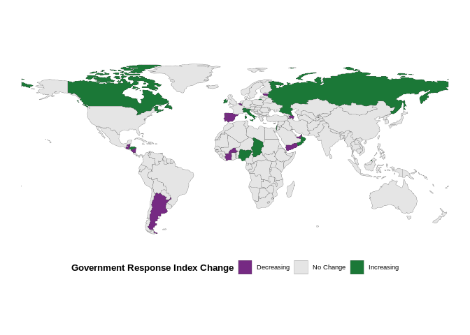

    ## --- 
    ## layout: recent_changes 
    ## title: Recent policy changes reported in the OxCGRT 
    ## permalink: /recent-changes/ 
    ## ---

This website contains recent policy changes reported in the global
Oxford COVID-19 Government Response Tracker (OxCGRT) database. It
includes policies which have come into force within the last two weeks.
It is arranged by country and then by indicator. For more details on the
coding policy please see our
[Codebook](https://github.com/OxCGRT/covid-policy-tracker/blob/master/documentation/codebook.md)
and [Interpretation
Guide](https://github.com/OxCGRT/covid-policy-tracker/blob/master/documentation/interpretation_guide.md).

Data in the OxCGRT database is recorded by volunteers from all over the
world on a weekly schedule. Our coverage may not yet be completely
up-to-date until the present day with recent policy changes. This site
is updated daily, so check back for the latest information.

## Global Changes in Government Response Index

The following map details the changes to the government response index
during the last two weeks. For more detail on the Government Response
Index please see the most recent [working
paper](https://www.bsg.ox.ac.uk/research/publications/variation-government-responses-covid-19)
or explore the [dataset
publication](https://doi.org/10.1038/s41562-021-01079-8).

## Changes in Policy over the last two weeks

Please see our
[Codebook](https://github.com/OxCGRT/covid-policy-tracker/blob/master/documentation/codebook.md)
for a full description of the policies we track.

### Argentina (GRI: 72.19 ↓ 69.38)

### Australia (GRI: 54.48 ↑ 62.81)

### Azerbaijan (GRI: 64.06 ↓ 59.38)

### Bangladesh (GRI: 56.15 ↑ 63.96)

### Belgium (GRI: 64.38 ↓ 59.38)

### Belize (GRI: 69.38 ↑ 71.98)

### Brunei (GRI: 44.37 ↑ 45.62)

### Burkina Faso (GRI: 39.06 ↓ 35.42)

### Canada (GRI: 70.83 ↑ 71.88)

### China (GRI: 72.45 ↓ 70.36)

### Cote d’Ivoire (GRI: 41.15 ↓ 39.06)

### Croatia (GRI: 42.19 ↑ 49.27)

### Denmark (GRI: 59.17 ↓ 56.04)

### Estonia (GRI: 41.67 ↓ 40.1)

### Finland (GRI: 55 ↑ 56.25)

### France (GRI: 60.68 ↓ 56.25)

### Guatemala (GRI: 53.54 ↓ 52.76)

### Honduras (GRI: 71.25 ↑ 72.5)

### Ireland (GRI: 67.81 ↑ 69.06)

### Israel (GRI: 44.27 ↑ 52.08)

### Italy (GRI: 78.7 ↑ 79.17)

### Liberia (GRI: 46.98 ↑ 53.75)

### Malta (GRI: 64.58 ↓ 62.5)

### Namibia (GRI: 51.35 ↑ 54.48)

### Nicaragua (GRI: 16.77 ↓ 12.6)

### Nigeria (GRI: 41.25 ↑ 42.5)

### Oman (GRI: 51.88 ↑ 74.79)

### Portugal (GRI: 70.62 ↓ 67.5)

### Qatar (GRI: 74.27 ↓ 72.71)

### Russia (GRI: 59.37 ↑ 61.2)

### Sierra Leone (GRI: 44.06 ↑ 50.83)

### Singapore (GRI: 76.56 ↓ 72.92)

### Spain (GRI: 60.78 ↓ 57.66)

### Switzerland (GRI: 53.23 ↑ 54.48)

### Tonga (GRI: 25 ↑ 30)

### Ukraine (GRI: 59.69 ↑ 60.21)

### United Arab Emirates (GRI: 65.89 ↓ 58.33)

### United Kingdom (GRI: 62.55 ↑ 63.8)

### Yemen (GRI: 38.85 ↓ 37.81)

### Zambia (GRI: 37.6 ↑ 46.04)
